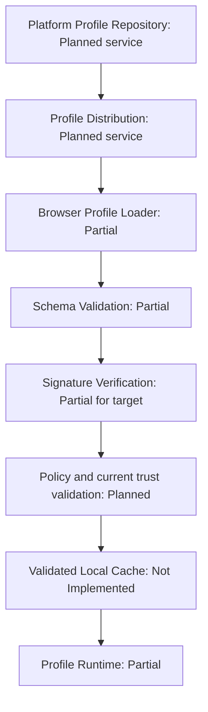
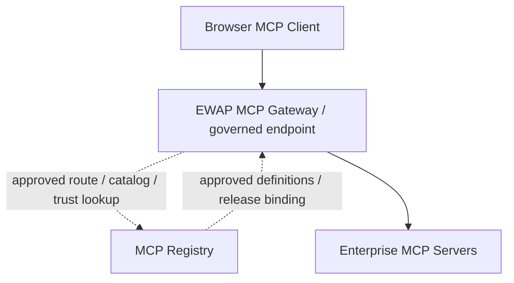

# 22. Page Profile distribution, trust and MCP design

> Aligned 2026-09-06. See [platform-alignment](platform-alignment.md) for pinned revisions, evidence, contract gaps and future tasks. Current implementation and target architecture are explicitly separate. No implementation is changed by this design.

## 1. Ownership and contract precedence

Workspace `ewap/v1` schemas are the shared authority. Platform owns Profile Service/Repository/Studio, distribution, signing, policy authoring, MCP Registry/Gateway and central audit. Browser owns loading, validation, local runtime enforcement and execution. Platform's reviewed architecture is a proposal, not an available deployed service.

Platform [Profile Manager](../../ewap-platform/docs/aidlc/modules/profile-manager-registry.md) makes the DB authoritative and permits redacted Git exports. The former Git-authoritative Profile source repository and local stdio management MCP in this document are **Deprecated Design** for Platform alignment. They were external tooling proposals, not Browser implementation. Browser must not acquire authoring, signing, Git administration or Registry mutation responsibilities.

Do not collapse three different formats:

| Format | Current meaning |
| --- | --- |
| Workspace `ewap/v1` PageProfile | Shared resource with metadata, match, page, optional mcpServers/workflows/policy/security |
| Platform `enterprise-web-ai/v1alpha1` proposal | Source resources and environment-specific SignedRelease, governed by Platform design |
| Browser `schema_version: 1` Profile | Implemented proprietary runtime response with request/page binding, integer profile_version and compact JWS |

Their relationship is unresolved [C01–C05/C08](platform-alignment.md). No example in this document makes them wire-compatible. Source, immutable release and per-request execution proof need explicit mappings before implementation.

## 2. Current implementation

[ProfileResolver](../extension/src/profile/resolver.ts) POSTs to the configured HTTPS URL, not a hard-coded `/v1/resolve` path. It checks the configured origin, rejects redirects, uses a five-second timeout and expects exactly `Content-Type: application/jose`.

```text
Current page DOM/ARIA snapshot
 → digest + semantic-projection-fp-v1
 → configured Resolver POST
 → application/jose compact JWS
 → ES256 signature verification
 → closed Profile claims + page binding + expiry checks
 → in-memory version/digest replay check
 → Ask context / read-only business bindings / Act workflow and action hints
```

The request contains schema_version, request_id, resolver_request_nonce, deployment_id and page origin/path/page_context_digest/fingerprint_alg/fingerprint. Current path is URL pathname with query/fragment excluded; it is not a Platform logical route template with embedded identifiers removed. No enterprise bearer authentication is added.

[verifyProfileJws](../extension/src/profile/jws.ts) accepts a compact ES256 JWS with `typ=company-page-profile+jws` and a kid from the local PEM key ring, limited to 64 KiB. [verifyProfileClaims](../extension/src/profile/profile.ts) validates schema_version 1, MATCHED/UNKNOWN, nonempty issuer, deployment audience, nonce, page digest, fingerprint and time. It checks expiry, a maximum 24-hour lifetime and up to five minutes of future issued_at; it does not bind issuer to a managed trust service.

MATCHED requires profile_id, a positive integer profile_version and matching origin/path_prefix. Optional tools/workflow/model_context/business_mcp use closed Browser validators. UNKNOWN cannot carry those action/context fields. Cryptographic validity does not establish Platform approval, current activation, revocation or enterprise user identity.

[ProfileReplayStore](../extension/src/profile/profile-replay.ts) accepts a higher version, or the same version with the same definition digest, and rejects regressions/conflicts. It is wired into resolve but survives only the current Service Worker instance. It is not a persistent artifact cache or a cross-restart rollback defense.

Ask catches resolve failures and continues without Profile context/business tools. Act catches PROFILE_UNAVAILABLE and may use current page-derived candidates and local workflows. Invalid Profile data is not activated, but Profile failure does not globally stop generic Browser execution.

## 3. Target Profile lifecycle and stage status



| Lifecycle stage | Status | Current implementation versus target |
| --- | --- | --- |
| Platform Profile Repository | Planned | Platform DB authority is designed; no service implementation in reviewed checkout |
| Profile Distribution | Planned | External proprietary Resolver is assumed by current client; Platform resolve/artifact distribution is not integrated |
| Browser Profile Loader | Partial | Current POST/JWS path exists. Planned authenticated `/runtime/v1/profile-resolve` and artifact retrieval differ in request, response and identity |
| Schema Validation | Partial | Closed proprietary claims and nested validators exist. Shared resource and release schemas are not consumed |
| Signature Verification | Partial | Compact ES256 verifier is Implemented. Flattened SignedRelease verifier is **Planned / Required for Platform Alignment** |
| Policy Validation | Partial | Local action guards and a partial Act PDP path exist. No release-level EnterprisePolicy/current-trust gate |
| Local Cache | Not Implemented | No persistent signed artifact cache; replay high-water is memory only |
| Profile Runtime | Partial | Context, action hints, local workflow and business HTTP consumption exist; shared resources and atomic dependency bundles are planned |

Target schema validation before signature verification checks untrusted shape and bounds only. Trust and activation require successful cryptography, payload/claims validation, current policy and release membership. Current code verifies signature before Profile claims; that existing order is not changed here.

### Versioning, refresh and activation rules (Target)

- Keep API version, source version, environment releaseId, adapter version, activation generation and trust epoch distinct. Do not reinterpret integer profile_version as Platform SemVer.
- Freeze exact Profile/Workflow/policy/MCP dependencies at Platform release time. Browser verifies the whole bundle before atomically changing the local active reference; partial download never becomes active.
- Resolve on page-scope change and refresh according to distribution/trust policy. Current Browser resolves on demand without a background refresh scheduler or cache TTL.
- Cache only verified immutable artifacts and bounded metadata, keyed by organization/application/environment/release/digest/consumer contract. Do not cache request nonces, credentials, page refs or action values. Recheck current trust and page binding on use; do not reuse a per-request JWS as an unrestricted cached release.
- Platform proposes a 24-hour release TTL and a maximum 60-second read-only trust stale window. Writes require online trust and PDP. These are target requirements, not implemented Browser guarantees or additions to the unchanged workspace schema.
- A refresh failure must not extend expiry or trust freshness. For required-profile routes, missing/invalid/expired/revoked/unsupported releases block activation/new actions. Optional community generic behavior remains separately governed.
- Schema/signature failure discards the candidate and emits a bounded rejection event in the target. A prior artifact is usable only while independently eligible under current trust, expiry and policy; there is no unconditional last-known-good fallback.
- Platform owns rollback eligibility. Browser accepts only a currently authorized complete release/activation transition and never lowers trust epoch or silently accepts a revoked release. Any mapping to the current monotonic integer version must be explicit.
- Preserve the current proprietary mode during a reviewed versioned transition. Select the consumer contract before parsing; never strip fields, guess a format, relabel HTTPS as standard MCP, or silently fetch a latest catalog.

## 4. Signing and trust

```text
Profile creation (Platform)
 → candidate freeze / approval / Platform signing
 → distribution
 → Browser signature verification
 → current key/release/server trust validation
 → policy + dependency checks
 → Profile activation
```

Platform [release/trust](../../ewap-platform/docs/aidlc/contracts/release-trust.md) proposes flattened JWS JSON (`protected`, `payload`, `signature`), `typ=enterprise-studio-release+jws`, ES256/P-256, canonical JCS payload, SHA-256 digests encoded as `sha256:` plus lowercase hex, environment and approval binding, current trust epoch, and 60-second clock skew. Browser's compact typ/payload, custom canonical helper and base64url digest are different. Existing ES256 verification is useful groundwork, not conformance with that release protocol.

Target verification binds issuer/kid, organization/environment, source/dependency/consumer digests, issuedAt/expiresAt, approval references and current active membership. Unknown/revoked keys and unavailable required trust fail closed. Browser never signs Profiles or holds Platform private keys. Public trust-root distribution/rotation and epoch persistence are planned. Repackaging a compact signature into a flattened envelope with a different typ/payload is not a valid migration.

## 5. MCP architecture and tool allow-list

### Current Development Mode / Legacy Compatibility

[BusinessMcpClient](../extension/src/profile/business-mcp-client.ts) sends `CALL_PAGE_BUSINESS_TOOL` directly to the signed binding endpoint. It uses HTTPS POST, JSON, a five-second timeout, redirect rejection and no supplied enterprise bearer token. Endpoint userinfo/query/fragment are rejected. This is proprietary read-only HTTP compatibility, not a standard MCP transport.

The exact current binding fields are `server_id`, `endpoint`, `tool_id`, `title`, `description`, `arguments`, `result_key`, `value_kind`, `max_result_chars`. The validator rejects added `catalog_checksum`, `server_release_id` or `environment` fields. Those formerly documented fields are future contract work, not current support.

The Profile allows at most 32 bindings with distinct tool_id values. Argument objects are closed, with up to 32 bounded string properties (maxLength at most 1,024). Text results are bounded to at most 4,000 characters. [Ask executor](../extension/src/service-worker/ask-tool-executor.ts) checks tool_id membership and that tool's exact argument schema; the model-facing enum alone is not enforcement. [Client result validation](../extension/src/profile/mcp.ts) checks kind/request ID/tool ID/result schema. Endpoint/JWS/nonces/digests are excluded from the model tool catalog; results remain untrusted data.

[Ask runner](../extension/src/service-worker/ask-chat-runner.ts) captures initial page digest/Profile proof and reuses them in tool requests. It checks run termination, but does not re-read the page, recheck Profile expiry/revoke or query PDP immediately before each business call. The former “fresh binding before every call” statement was a target, not current behavior. Existing errors are BUSINESS_MCP_* codes, not the full Platform MCP_* envelope.

### Target Governed Mode



Conceptually `Browser → governed endpoint → Registry-approved server → enterprise service`; Registry is control-plane metadata, not an extra per-call business proxy. Platform discovery workers own catalog discovery, health, checksums and capability/risk overlays. Browser consumes the approved release view and does not administer Registry records or call live tools/list for the current compatibility mode.

PROD requires Gateway. DEV/TEST/STAGE direct mode is only a **Supported Direct Mode target** when Security Admin grants an environment-specific exception with equivalent identity, policy, trust, audit and revoke enforcement. Current direct client code does not prove such an exception.

### Shared conceptual fields and unresolved mapping

| Shared PageProfile.mcpServers field | Current Browser representation | Target requirement / gap |
| --- | --- | --- |
| id | server_id | Stable Registry identity, scoped to approved release |
| name | No server display-name field; title describes a tool | Preserve server display name separately; do not rename title to server name |
| url | endpoint | Governed route selected by Platform; shared schema requires a URL while Platform source uses serverRef-only (C03) |
| transport | No field; proprietary HTTPS is implicit | Shared enum streamable-http/sse/stdio is not implemented. Define a versioned compatibility representation |
| tools | Flattened tool_id + closed arguments/result metadata | Exact release allow-list intersected with organizational policy and consumer-supported tools |

The separate shared McpServer also defines authentication references and inputSchema. Credentials belong in Platform secret/auth infrastructure, never Profile metadata, model context or audit. Browser is not required to spawn stdio processes simply because the shared registry enum can describe them; supported transport subsets must be negotiated and unsupported ones rejected.

Target allow-list enforcement uses the intersection of approved Registry catalog, Profile-selected tools/capabilities, EnterprisePolicy domains/actions/servers/tools, current PDP and Browser hard guards. Explicit deny wins. Ambiguous tool identity, unknown tool/argument, incompatible schema or stale/revoked binding blocks dispatch. Gateway independently repeats authentication, authorization, replay, schema and size checks. Untrusted output never changes that allow-list.

## 6. Verification and migration recommendations

Existing unit tests inspect compact signature/tampering, resolver replay conflict, closed MCP bindings/results and HTTP rejection: [JWS](../extension/tests/unit/profile/jws.test.ts), [resolver](../extension/tests/unit/profile/resolver.test.ts), [bindings](../extension/tests/unit/profile/mcp-binding.test.ts), [client](../extension/tests/unit/profile/business-mcp-client.test.ts). They do not establish Platform service or real Chrome integration.

Future order: resolve shared contract gaps → define producer adapter/consumer versions → implement authenticated distribution/trust/policy → integrate Gateway and audit → validate supported workflows and cache migration → obtain real Chrome L5 evidence. Require old/new format negative cases, rollback/revoke/restart, policy denial and approval replay, stale page calls, unknown tools, auth failure and privacy checks. No server, adapter, signature, cache or client code is implemented by this document.
