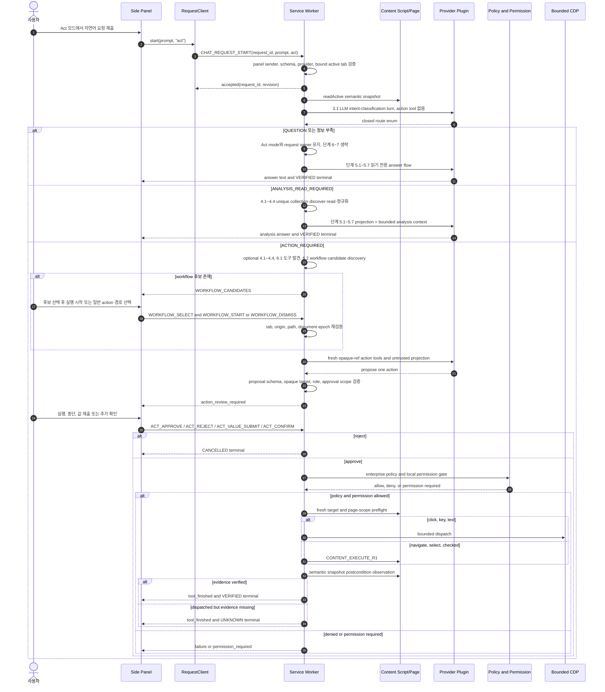
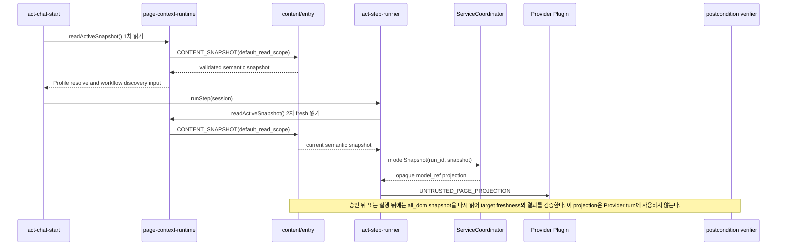

# 31. Act 요청 처리 현재 구현 경로

- 작성일: 2026-09-21
- 수정일: 2026-09-22
- 상태: AS-IS 구현 인벤토리
- 범위: Side Panel에서 Act 모드 자연어 요청을 보낸 뒤, 사용자 검토·실행·결과 검증을 거쳐 종료하는 Browser 내부 경로
- 비범위: 실제 회사 Provider 또는 특정 대상 사이트에서의 Chrome 재현 성공 판정. 이 문서는 현재 소스 코드의 호출 경로를 기록한다.

## 1. 요약

Act는 모델이 곧바로 페이지를 조작하는 구조가 아니다. 현재 구현된 한 요청은 다음 단계를 따른다.

1. Side Panel과 `RequestClient`가 Act 요청 ID를 만들고 `CHAT_REQUEST_START`를 전송한다. Service Worker는 인증된 Panel, request schema, provider와 Panel에 결합된 active tab을 검사·고정하고 durable request 수명 상태를 시작한다(3절 단계 1.1~1.4).
2. `createActChatStart()`가 초기 semantic snapshot을 준비하고, action tool·workflow 후보 없이 별도 Provider turn으로 닫힌 route를 판별한다(3절 단계 2.1~3.1). 정보성 Act 요청은 action tool 계산이나 workflow 후보 대기 없이 Act 모드의 읽기 전용 runner로 간다.
3. 단계 3.1은 `QUESTION`, `ANALYSIS_READ_REQUIRED`, `ACTION_REQUIRED`를 결정한다. `QUESTION`은 Act 모드를 유지한 채 33번과 동일한 단계 5.1~5.7 읽기 전용 답변 흐름을 사용한다. `ANALYSIS_READ_REQUIRED`는 bounded collection 수집 뒤 단계 5.1~5.7로 간다. `ACTION_REQUIRED`만 선택적 explicit collection read와 단계 6.1~7.5.1을 사용한다.
4. 현재 action 경로에서는 workflow를 선택·시작하는 경우에만 scope snapshot을 다시 확인한다. 그 뒤 `runStep()`은 fresh model projection과 opaque `model_ref` tool을 만들어 Provider에 전달하고, Provider는 tool 없는 정보성 답변 또는 유효한 **한 개의 실행 제안**을 반환할 수 있다(단계 6.1~6.5).
5. 실행 제안은 Panel의 검토, 승인·거절, 값 입력 또는 추가 확인을 거친다. 승인 뒤에만 enterprise policy·local permission·page scope·target freshness를 재검사하고 bounded CDP 또는 Content Script로 dispatch한 뒤 semantic evidence로 결과를 판정한다(단계 7.1~7.5.1).

단계 3.1과 Act용 단계 5.1~5.7은 구현됐다. 현재 단계 4는 explicit analysis request의 unique collection만 다룬다. 복수 source Panel 선택·승인 뒤 재개, reviewed `page_api_read` adapter와 실제 Chrome Side Panel 증적은 아직 없다.

## 2. 전체 시퀀스



## 3. 단계별 파일·메서드 현황

단계 번호는 문서 절 번호가 아니라 Ask/Act 공통 실행 흐름을 나타낸다. 31번과 33번에서 같은 번호는 같은 책임을 뜻한다.

| 단계                                      | 파일 및 메서드                                                                                                                                                     | 현재/목표 동작                                                                                                                                                                                                                                                    | 상태                             |
| ----------------------------------------- | ------------------------------------------------------------------------------------------------------------------------------------------------------------------ | ----------------------------------------------------------------------------------------------------------------------------------------------------------------------------------------------------------------------------------------------------------------- | -------------------------------- |
| 1.1 모드 선택·질문 제출                   | `extension/src/sidepanel/entry.ts`의 `modeAct` click, `chatForm` submit                                                                                            | `chatMode`를 `act`로 설정하고, 사용자 메시지를 로컬 transcript에 표시한 뒤 활성 run을 잠근다. `RequestClient.start()`를 호출한다.                                                                                                                                 | Implemented                      |
| 1.2 요청 ID·상태 복구                     | `extension/src/sidepanel/request-client.ts`의 `start`, `poll`, `cancel`                                                                                            | UUID request ID로 `CHAT_REQUEST_START`를 전송한다. 5초 ACK timeout은 즉시 중복 실행하지 않고 동일 ID의 `CHAT_REQUEST_STATUS` polling으로 복구한다. 취소도 같은 ID로 보낸다.                                                                                       | Implemented                      |
| 1.3 요청 경계                             | `extension/src/service-worker/chat-request-message-handler.ts`의 `createChatRequestMessageHandler().start/statusOrCancel`                                          | 정확한 schema, Panel sender, prompt 길이, provider 가능 여부를 검사한다. 인증된 Panel이 바인딩된 active tab을 request owner로 고정하고 flush 성공 뒤 Act runner를 시작한다.                                                                                       | Implemented                      |
| 1.4 요청 수명                             | `extension/src/service-worker/chat-request-lifecycle.ts`의 `startRun`, `settled`, `finish`, `progress`                                                             | 요청 상태를 `ACCEPTED`, `RUNNING`, `WAITING_USER`, `TERMINAL`로 관리한다. dispatch 전 durable 표식을 남기며, dispatch 이후 실패/취소는 `UNKNOWN`으로 보존한다.                                                                                                    | Implemented                      |
| 2.1 Act 준비                              | `extension/src/service-worker/act-chat-start.ts`의 `createActChatStart`                                                                                            | snapshot을 읽고 request 취소 및 document epoch를 검사한다. Profile resolve 실패 중 `PROFILE_UNAVAILABLE`은 일반 페이지 Act 후보를 위한 즉시 실패 사유가 아니다.                                                                                                   | Implemented                      |
| 2.2 초기 semantic projection 수집         | `act-chat-start.ts`의 `createActChatStart` → `page-context-runtime.ts`의 `read` → `content/entry.ts`의 `CONTENT_SNAPSHOT`                                          | `default_read_scope`의 현재 semantic snapshot을 수집한다. document epoch 확인, Profile resolve, workflow 후보 수집의 입력이며 이 snapshot 전체를 Provider에 직접 보내지는 않는다.                                                                                 | Implemented                      |
| 3.1 요청 처리 route 결정                  | `ask-act-intent-router.ts`의 `createAskActIntentRouter`, `validateActIntentRoute`                                                                                  | Browser가 prompt와 bounded visible text만 별도 LLM turn에 보낸다. 한 field의 closed JSON route와 tool-call 없음이 모두 맞을 때만 route를 수용하며, 그 밖에는 `QUESTION`으로 fail closed 한다.                                                                     | Implemented                      |
| 4.1~4.3 분석 source·R0 read               | `analysis-data-acquisition.ts`의 `createAnalysisDataAcquisition`                                                                                                   | `ANALYSIS_READ_REQUIRED`와 explicit collection-analysis action은 unique collection만 discover·R0 검사·bounded read한다. 복수 source, scope 변경, permission 미허용은 unavailable context로 끝나며 Page API candidate는 호출하지 않는다.                           | Partial                          |
| 4.4 결과 정규화·Provider 재투입           | `analysis-data-acquisition.ts`, `ask-chat-runner.ts`, `act-step-runner.ts`                                                                                         | bounded sanitized cells, coverage, reason, count, truncated만 현재 request turn에 전달한다. raw row ID/cursor/selector/function path/endpoint는 전달·저장하지 않는다.                                                                                             | Implemented for collection       |
| 5.1~5.7 Act 읽기 전용 runner              | `ask-chat-runner.ts`의 mode-bound runner                                                                                                                           | `QUESTION`/`ANALYSIS_READ_REQUIRED`는 `mode=act`와 request owner를 유지해 Ask read tools만 제공하고 action proposal, workflow, dispatch 없이 답변 또는 실패로 종료한다.                                                                                           | Implemented                      |
| 6.1 action 도구 발견                      | `page-derived-actions.ts`, `selectActActionTools`                                                                                                                  | `ACTION_REQUIRED`일 때만 visible/enabled control에서 action tool을 구성한다.                                                                                                                                                                                      | Implemented                      |
| 6.2 workflow 분기                         | `act-chat-start.ts` 및 workflow handlers                                                                                                                           | `ACTION_REQUIRED`일 때만 후보를 표시·선택·계획 확인한다.                                                                                                                                                                                                          | Implemented                      |
| 6.3 workflow 선택 snapshot 재수집         | `workflow-selection-message-handler.ts`와 `workflow-start-message-handler.ts`의 `active()`                                                                         | workflow 후보가 있을 때만 fresh snapshot을 다시 수집한다. 후보 생성 시점의 tab, origin, path, document epoch가 바뀌면 `WORKFLOW_STATE_MISMATCH`로 거절한다.                                                                                                       | Implemented, conditional         |
| 6.4 action Provider turn                  | `extension/src/service-worker/act-step-runner.ts`의 `runStep`; `act-tools.ts`의 `genericActTools`                                                                  | 새 run과 fresh model snapshot을 만들고, 모델에는 opaque `model_ref` enum을 가진 도구만 제공한다. prompt는 tool 없는 정보성 응답을 허용하고, action은 하나의 제안만 허용한다.                                                                                      | Implemented                      |
| 6.4.1 Provider용 fresh projection 수집    | `act-step-runner.ts`의 `runStep` → `readActiveSnapshot` → `coordinator.ts`의 `modelSnapshot`                                                                       | 현재 페이지를 다시 수집하고 source `ref_id`를 run-scoped opaque `model_ref`로 바꾼다. visible·enabled·허용 role의 model ref만 tool enum에 넣고, projection은 `[UNTRUSTED_PAGE_PROJECTION]`으로 Provider에 전달한다.                                               | Implemented                      |
| 6.5 action 제안 파싱                      | `extension/src/service-worker/act-proposal-parser.ts`의 `parseActProposal`, `parsePageApiProposal`                                                                 | tool 이름, closed keys, model ref, enabled target, role, option value, approval reason을 검증한다. selector, 좌표, JavaScript, 임의 URL은 제안 입력이 될 수 없다.                                                                                                 | Implemented                      |
| 7.1 검토 카드                             | `extension/src/sidepanel/entry.ts`의 `renderReview`, `renderValue`, `renderConfirmation`; `act-review-message-handler.ts`의 `handle`                               | Panel은 제안 이유·승인 범위를 보이고 `ACT_APPROVE`, `ACT_REJECT`, `ACT_VALUE_SUBMIT`, `ACT_CONFIRM`만 전송한다. Worker는 sender, session ID, proposal ID, confirmation nonce를 검증한다.                                                                          | Implemented                      |
| 7.2 정책·실행 준비                        | `extension/src/service-worker/act-proposal-executor.ts`의 `executeProposal`; `act-proposal-readiness.ts`의 `prepareActProposal`; `act-proposal-followup.ts`        | enterprise authorization, local permission mode, plan scope, fresh active page/target을 재검사한다. 입력값 또는 confirmation이 필요하면 dispatch 전 `VALUE_REQUIRED` 또는 `CONFIRMATION_REQUIRED`에서 멈춘다. resume 시 enterprise authorization을 다시 요청한다. | Implemented                      |
| 7.2.1 승인 target preflight snapshot 수집 | `act-proposal-executor.ts`의 `executeProposal` → `readActiveSnapshot`                                                                                              | 승인된 session의 tab, origin, document epoch와 target enabled 상태를 실행 직전에 다시 수집·확인한다. 검사가 통과하기 전에는 `prepareActProposal()`과 dispatch를 진행하지 않는다.                                                                                  | Implemented                      |
| 7.3 dispatch                              | `extension/src/service-worker/act-execution-runtime.ts`의 `executeBounded`, `executeContent`; `runtime-execution.ts`                                               | click/key/text는 bounded CDP로, navigate/select/checked는 Content Script `CONTENT_EXECUTE_R1`로 보낸다. 실행 직전 active request와 page registration을 확인한다.                                                                                                  | Implemented, bounded             |
| 7.4 완료 판정                             | `extension/src/service-worker/act-postcondition-verifier.ts`의 `verify`, `evaluate`, `waitForPageTransition`; `act-proposal-completion.ts`의 `completeActProposal` | 최대 15초, 200ms 간격으로 semantic evidence를 관측한다. DOM 교체는 유일한 role/name 재식별만 허용한다. navigation은 URL 변화만으로 확정하지 않고 새 scope와 fresh snapshot을 요구한다.                                                                            | Implemented, evidence-limited    |
| 7.4.1 결과 증거 snapshot 반복 수집        | `act-postcondition-verifier.ts`의 `verify`, `evaluate`, `waitForPageTransition` → `readActiveSnapshot("all_dom")`                                                  | dispatch 뒤 최대 15초 동안 200ms 간격으로 all-dom snapshot을 반복 수집한다. semantic state/UI relation/유일한 재식별 또는 navigation의 새 scope와 fresh snapshot을 확인하며, Provider에는 전달하지 않는다.                                                        | Implemented, bounded observation |
| 7.5 후속 단계·정리                        | `act-proposal-completion.ts`의 `completeActProposal`; `act-step-runner.ts`의 `continueWorkflow`; `runtime-chat.ts`의 `endSession`                                  | 성공한 non-navigation action만 다음 workflow step 또는 bounded session continuation으로 진행할 수 있다. session 자동 continuation은 최대 12회이며, navigation/Page API/실패/UNKNOWN은 세션과 권한을 정리한다.                                                     | Implemented                      |
| 7.5.1 후속 step fresh projection 재수집   | `act-step-runner.ts`의 `continueWorkflow` → `runStep` → 단계 6.4.1                                                                                                 | 성공한 non-navigation action만 이전 projection을 재사용하지 않고 단계 6.4.1의 fresh Provider projection 수집으로 다시 시작한다. navigation/Page API/실패/취소/`UNKNOWN`은 이 경로로 이어지지 않고 세션을 종료한다.                                                | Implemented, conditional         |

### 3.1 route 결정 계약 — 실행 단계 3.1

단계 3.1은 사용자가 선택한 `mode=act`를 `ask`로 바꾸는 단계가 아니다. Act 안에서 후속 capability와 workflow 탐색 여부를 제한하는 fail-closed route 결정이다. `ask-act-intent-router.ts`는 **LLM에 별도 intent-classification turn을 요청**한다.

이 LLM turn의 입력은 정규화된 prompt와 initial semantic projection의 읽기 문맥이다. target `model_ref`, selector, action tool schema, workflow candidate, Page API action, approval 정보는 주지 않는다. 응답은 설명문이나 tool call이 아닌 아래 closed enum 하나여야 하며, `validateRoute()`가 이를 검증한다.

```ts
type ActIntentRoute = "QUESTION" | "ANALYSIS_READ_REQUIRED" | "ACTION_REQUIRED";
```

단계 3.1은 사용자에게 답변을 생성하는 turn이 아니라 **방향만 정하는 LLM turn**이다. `QUESTION`과 `ANALYSIS_READ_REQUIRED`는 33번과 동일한 단계 5.1~5.7 읽기 전용 답변 흐름에서 답변을 만들고, `ACTION_REQUIRED`만 단계 6의 action tool과 workflow 후보를 준비한다.

| route                    | 뒤따르는 경로                                                                                              | action·사용자 확인                                         |
| ------------------------ | ---------------------------------------------------------------------------------------------------------- | ---------------------------------------------------------- |
| `QUESTION`               | 단계 4와 단계 6~7을 건너뛰고 단계 5.1~5.7로 간다. 현재 projection으로 답하거나 정보 부족을 설명한다.       | action tool, workflow 후보, review card, 사용자 확인 없음  |
| `ANALYSIS_READ_REQUIRED` | 단계 4.1~4.4의 R0 분석 data 수집 뒤 단계 5.1~5.7로 간다.                                                   | 수집 capability만 별도 검사하며 mutation approval 없음     |
| `ACTION_REQUIRED`        | analysis가 선행 조건이면 단계 4.1~4.4를 수행한 뒤 단계 6의 action 제안과 단계 7의 승인·실행·검증으로 간다. | action proposal이 생긴 뒤에만 단계 7의 승인·실행 경로 사용 |

`QUESTION`은 새 Ask 요청을 만들거나 `mode`를 변경하지 않는다. 단계 1.1~3.1에서 확정한 Act request ID, Panel owner, tab/document scope와 취소 신호를 그대로 유지하고, 읽기 전용 답변 책임만 [33번 문서](33-ask-request-execution-current-implementation.md)의 단계 5.1~5.7과 공유한다. 현재 `ask-chat-runner.ts`는 `mode="ask"`만 허용하므로 구현 시 이를 직접 재호출하지 않고 공통 read-only answer runner를 추출하거나 동등한 공통 경계를 만들어야 한다.

의도가 불명확하거나 LLM route 응답의 schema가 맞지 않을 때는 `ACTION_REQUIRED`로 승격하지 않는다. Worker는 `QUESTION`으로 처리해 현재 페이지에서 확인 가능한 정보를 답하고, 불충분한 점을 자연어로 설명한다. action은 오직 LLM이 `ACTION_REQUIRED` route를 반환한 뒤 Provider가 유효한 한 개 proposal을 반환하고 기존 승인 단계를 통과할 때만 가능하다.

## 4. 실행 결과별 경로

| 결과                                       | 조건                                                       | 처리                                                                              |
| ------------------------------------------ | ---------------------------------------------------------- | --------------------------------------------------------------------------------- |
| `ANSWER`                                   | Provider가 tool call 없이 텍스트 응답                      | assistant delta를 발행하고 run을 `VERIFIED`로 종료한다.                           |
| `WORKFLOW_CANDIDATES`                      | 현재 페이지에 적용 가능한 workflow 후보 존재               | 사용자 선택과 별도 시작 전까지 request를 `WAITING_USER`로 둔다.                   |
| `AWAITING_REVIEW`                          | 유효한 action proposal 한 개                               | 실행하지 않고 review card를 표시한다.                                             |
| `VALUE_REQUIRED` / `CONFIRMATION_REQUIRED` | 실행 정의가 값 입력 또는 추가 확인 요구                    | binding/nonce가 일치하는 후속 메시지 전에는 dispatch하지 않는다.                  |
| `VERIFIED`                                 | semantic postcondition 또는 fresh navigation evidence 충족 | tool result와 terminal event를 발행한다.                                          |
| `FAILED`                                   | dispatch 전 정책, binding, target, contract 실패           | 페이지 효과 없이 실패로 끝낸다.                                                   |
| `CANCELLED`                                | 사용자가 review에서 중단하거나 request를 취소              | session/run을 종료한다. 이미 dispatch됐다면 페이지 효과를 되돌렸다는 뜻은 아니다. |
| `UNKNOWN`                                  | dispatch 뒤 CDP/content 오류 또는 완료 증거 부족           | 자동 재시도하지 않고 불확실한 결과로 끝낸다.                                      |

## 5. 현재 지원 한계와 미연결 항목

- Ask와 Act는 explicit request의 unique collection을 자동 discover·R0 검사·bounded 수집 뒤 같은 request의 answer/action Provider turn에 재투입한다. 복수 source 선택, permission 승인 뒤 재개, reviewed Page API read adapter는 아직 없다.
- 29번 Page API Discovery도 수동 redacted hint scan이며, 현재 Ask/Act Provider run의 분석 source 또는 data read로 연결되지 않는다. 28번 collection과 reviewed read-only Page API adapter를 단계 4.1~4.4의 공통 분석 수집 단계로 연결하는 목표 계약은 [32번](32-ask-act-analysis-data-acquisition-design.md)에 정의한다.
- route classifier가 invalid JSON 또는 tool call을 반환하면 `QUESTION`으로 fail closed 한다. Provider 오류, 복수 source 선택, permission 승인 뒤 재개는 action route로 승격하거나 자동 재시도하지 않는다.
- 범용 Act target은 현재 semantic snapshot에서 visible·enabled로 관측되고 도구 schema가 허용한 control에 한정된다. 임의 DOM selector, 좌표, page script 실행은 지원하지 않는다.
- 결과 검증은 semantic state, UI relation, navigation scope/snapshot evidence에 의존한다. 사이트별 WebSocket·비동기 결과 세대와 `render_result` 계약은 일반화돼 있지 않다.
- 코드 단위 구현 상태와 실제 Chrome/실제 Provider 검증 상태는 다르다. 특정 사이트에서의 성공 판정에는 build, unpacked extension reload, trace, 대상 시나리오 증거가 추가로 필요하다.

## 6. Page semantic projection 단계

### 6.1 Act 흐름 안에서의 위치

**현재 action 경로의** Act 요청에는 같은 페이지를 읽는 시점이 둘 이상 있다. 현재 Provider에 전달되는 projection은 Act 준비 단계의 첫 snapshot이 아니라, `runStep`이 Provider 호출 직전에 다시 읽은 **fresh snapshot**이다.

단계 3.1이 `QUESTION` 또는 `ANALYSIS_READ_REQUIRED`를 반환하면 action용 `runStep`으로 가지 않는다. 이 경우 단계 5.1은 Act-bound read-only runner를 사용한다. tab/document/page scope가 달라졌으면 새 page에 자동 재결속하지 않고 `PAGE_SCOPE_STALE`로 끝낸다.



| 읽기 시점             | 호출 위치                                                                                                    | 용도                                                                    | Provider 전달 여부                                                |
| --------------------- | ------------------------------------------------------------------------------------------------------------ | ----------------------------------------------------------------------- | ----------------------------------------------------------------- |
| 1차 준비 읽기         | `extension/src/service-worker/act-chat-start.ts`의 `createActChatStart`                                      | 현재 document epoch 확인, Profile resolve, workflow 후보 수집           | 현재 action 경로에는 직접 전달하지 않음. Proposed 단계 5에는 전달 |
| 2차 실행계획 읽기     | `extension/src/service-worker/act-step-runner.ts`의 `runStep`                                                | fresh run 생성, 현재 action tool 후보 생성, 모델 turn의 projection 생성 | 전달함                                                            |
| 승인 직전 읽기        | `extension/src/service-worker/act-proposal-executor.ts`의 `executeProposal`                                  | tab/origin/document epoch/target enabled freshness 재검증               | 전달하지 않음                                                     |
| dispatch 뒤 검증 읽기 | `extension/src/service-worker/act-postcondition-verifier.ts`의 `evaluate`, `verify`, `waitForPageTransition` | semantic postcondition, 새 page scope 및 fresh navigation snapshot 확인 | 전달하지 않음                                                     |

기본 read scope는 `all_dom`이며, 설정에서 `visible_only` 또는 `interactive`로 바꿀 수 있다. `all_dom`은 hidden semantic node도 읽기 문맥에는 포함할 수 있지만, action tool은 visible·enabled node만 대상으로 한다.

### 6.2 Content Script의 projection 생성 순서

`extension/src/content/entry.ts`의 `CONTENT_SNAPSHOT` handler와 `projection()`은 다음 순서로 실행된다.

1. 현재 URL이 이전 page scope와 달라졌는지 확인한다. 달라졌다면 retained ref, delivery 상태, collection 상태를 정리하고 새 `page_scope_epoch`를 등록한다.
2. 현재 document를 Service Worker에 등록한다. 등록에 실패하면 `DOCUMENT_NOT_REGISTERED`를 반환하고 projection을 만들지 않는다.
3. `projectionNodes(scope)`가 `document.body`에서 DOM 순서로 element tree를 순회한다.
4. 순회 한도는 DOM element 12,000개, selector candidate 1,500개, 최종 semantic node 1,000개다. 어느 한도를 넘으면 `truncated: true`를 표시하고 중단한다.
5. 각 candidate에서 semantic role, accessible name, 민감 input 여부, visibility, scope 적합성, state와 action 관련 metadata를 순서대로 계산한다.
6. node projection이 끝난 뒤 단일 `application/contextpilot-workflow+json` declaration을 읽는다.
7. `visible_text`와 `article_text`를 만든다.
8. `{ origin, snapshot, workflow? }`를 반환하고, handler가 `node_count`를 채운다.

수집 대상 selector는 `button`, `input`, `textarea`, `select`, `option`, `a`, `[role]`, `h1`~`h6`이다. 지원하는 semantic role은 button, checkbox, combobox, heading, link, option, radio, textbox, listbox, tab, menuitem, dialog, alert, status, navigation, main, form이다.

### 6.3 하나의 semantic node를 만드는 순서와 필드

candidate 하나는 아래 순서로 처리된다.

1. **Role**: 지원되는 명시 ARIA role을 우선하고, 없으면 native button/input/textarea/select/option/a/heading을 role로 해석한다.
2. **Name**: `aria-label` → `aria-labelledby` 대상 text → native label → element text 순으로 선택하고, 제어문자 제거·공백 정규화·160자로 제한한다.
3. **민감 input 제외**: password/hidden input, 이름이 password·secret·OTP·MFA·인증·비밀번호 계열인 input, `autocomplete=one-time-code` input은 node로 만들지 않는다.
4. **Visibility**: `aria-hidden`, CSS `display`/`visibility`/`opacity`, 숨겨진 조상, 닫힌 `details`, layout box 부재, viewport 밖 여부를 검사해 `visible`, `visibility`, `hidden_reason`을 결정한다. native option은 owning select의 visibility를 사용한다.
5. **Scope filter**: `visible_only`는 hidden node를 제외하고, `interactive`는 visible interactive role만 남긴다. `all_dom`은 지원되는 hidden semantic node를 읽기 문맥에 남긴다.
6. **State**: `disabled`, checkbox/radio `checked`, select 또는 ARIA `selected`, ARIA `expanded`, `required` boolean만 closed state로 수집한다.
7. **Action metadata**: `enabled`, link/menuitem의 same/cross-origin navigation 여부, option의 combobox/listbox parent ref를 기록한다.
8. **Reference**: element·role·name에 결합된 opaque `ref_id`를 부여한다. MutationObserver는 name/role/상태에 영향을 주는 DOM 변경에서 기존 ref를 stale로 만든다.

최종 snapshot에는 `schema_version`, `document_epoch`, `frame_id`, `scope`, `truncated`, `node_count`, `nodes`, `visible_text`, 선택적 `article_text`가 들어간다. node에는 `ref_id`, `role`, `name`, `state`, `visible`, `enabled`와 필요한 visibility/navigation/parent metadata만 들어간다.

`visible_text`는 script/style/noscript/template/hidden/`aria-hidden` 영역을 제외한 body text를 최대 12,000자로 정규화한다. `article_text`는 visible `article`, `main`, `[role=main]` 후보 최대 4개 중 가장 긴 text를 최대 50,000자로 보관한다.

### 6.4 Service Worker 검증과 모델 projection 변환

`extension/src/service-worker/page-context-runtime.ts`의 `read()`는 Content 응답의 다음 경계를 확인한다.

1. active tab과 응답 origin이 일치하는지 확인한다.
2. `validateSemanticSnapshot()`으로 closed schema, node role/state, 참조 관계, text 및 배열 한도를 검증한다.
3. 응답의 `document_epoch`가 등록된 현재 document와 일치하는지 확인한다.
4. 검증된 raw semantic snapshot과 origin/path를 Act 흐름에 반환한다.

그 다음 `extension/src/service-worker/coordinator.ts`의 `modelSnapshot()`은 source `ref_id`를 매 run마다 새 opaque `model_ref`로 치환한다. `parent_ref_id`와 `label_ref_id`도 해당 model ref로 치환한다. 모델에게는 원본 ref, selector, CDP token을 주지 않는다.

모델 projection에는 node의 role/name/state/visibility/enabled와 `visible_text`/`article_text`가 유지된다. 단, 실행 authority를 위한 reverse map에는 visible node만 넣고, `act-tools.ts`는 그 중 visible·enabled·허용 role인 `model_ref`만 tool enum으로 제공한다. 그러므로 hidden node는 읽기 문맥일 수 있어도 Act target이 될 수 없다.

`act-step-runner.ts`는 이 JSON을 `[UNTRUSTED_PAGE_PROJECTION]` wrapper 안에 넣어 Provider에 보낸다. 페이지 내용은 instruction이 아니라 신뢰하지 않는 data로 취급한다.

### 6.5 현재 Provider egress 경계

현재 Content collector는 민감 input control을 node 단계에서 제외한다. 그러나 `visible_text`와 `article_text`에는 일반적으로 화면에 보이는 text가 들어가며, Act 직전 serialization은 `JSON.stringify()`다. 이 projection 전체에는 Provider 호출 직전 `redactForChat()`을 추가 적용하지 않는다.

따라서 현 구현에서 password/OTP 계열 input은 제외되지만, 화면에 표시된 일반 업무 데이터가 `visible_text` 또는 `article_text`에 포함될 수 있다. 이 문서의 projection 설명은 이 구현 사실을 기록한 것이며, Provider egress의 추가 redaction 보장을 의미하지 않는다.

## 7. 관련 문서

- [24. 실행 정지 방지와 개발용 실행 추적 설계](24-act-liveness-and-diagnostics-design.md)
- [25. Act 완료 조건과 비동기 화면 갱신 검증](25-act-completion-conditions.md)
- [26. 화면 변경 후 Act 결과 미확인 개선 설계](26-act-result-observation-design.md)
- [27. 페이지 내부 함수·공개 API 실행 설계](27-page-api-execution-design.md)
- [28. 객체 특성별 Collection Reading 설계](28-collection-reading-strategy-design.md)
- [29. Page API Discovery 설계](29-page-api-discovery-design.md)
- [32. Ask/Act 분석 데이터 수집 통합 설계](32-ask-act-analysis-data-acquisition-design.md)
