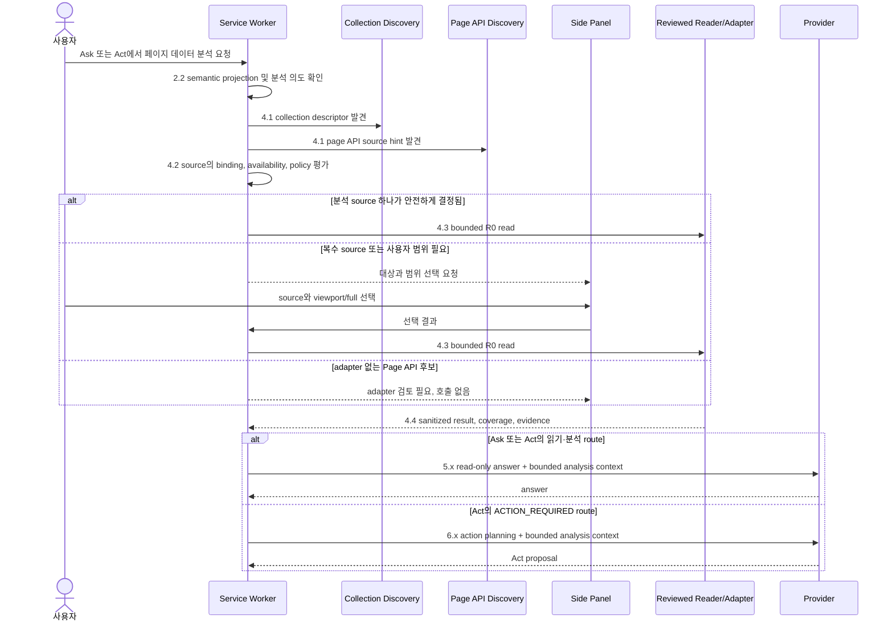

# 32. Ask/Act 분석 데이터 수집 통합 설계

- 작성일: 2026-09-21
- 수정일: 2026-09-22
- 상태: In progress — Ask의 explicit unique-collection 경로와 Act의 closed
  route gate/read-only 재투입, 명시적 분석이 선행된 action route의 bounded
  collection context를 구현했다. 실제 Side Panel과 HTTPS 제어 provider fixture는
  Ask/Act의 unique-source context 전달을 검증했다. 수집 중 page scope 변경·
  취소·시간 초과 시 이미 수집한 행의 Provider 재투입을 차단한다. 복수 source
  selection UI/승인 뒤 같은 request 재개와 Page API read adapter는 Proposed다.
- 범위: Ask/Act 요청에서 페이지의 분석 대상을 발견·선택·권한 확인·수집하고, bounded 결과만 같은 요청의 Provider 분석에 전달하는 공통 경로
- 관련: [아키텍처](01-architecture.md), [Page API 실행](27-page-api-execution-design.md), [Collection Reading](28-collection-reading-strategy-design.md), [Page API Discovery](29-page-api-discovery-design.md), [Act 현재 구현 경로](31-act-request-execution-current-implementation.md), [Ask 현재 구현 경로](33-ask-request-execution-current-implementation.md)

## 1. 결정

Collection Reading과 Page API Discovery를 독립 Side Panel 도구로만 끝내지 않는다. Ask/Act의 page-data 분석 의도가 확인되면, Provider 실행계획 turn 전에 Browser가 두 경로를 공통 분석 데이터 수집 단계로 사용한다.

현재 `createAnalysisDataAcquisition()`은 Ask의 명시적 분석 문구에 한해
collection descriptor를 발견한다. 대상이 정확히 하나이고 기존
`collection_read` R0 허용이 있으며 document/page scope가 일치할 때만
`full` read를 시작해 같은 Ask Provider turn에 bounded context를 넣는다.
복수 대상, permission 미허용, Page API candidate는 fail-closed
`unavailable` context로 남기며, 자동 선택·호출하지 않는다.

단, 두 경로의 권한은 다르다.

- **28번 Collection Reading**은 DOM/ARIA 객체에서 sanitized record를 읽는 R0 `collection_read` source다.
- **29번 Page API Discovery**는 source 후보를 발견하는 R0 discovery source다. 후보 자체는 데이터·실행 권한·Provider 입력이 아니다.
- 29번 후보를 실제 분석 데이터로 읽으려면 사람이 검토·번들 배포한 **read-only Page API adapter**가 필요하다. adapter가 없는 후보는 `REQUIRES_ADAPTER_REVIEW`로만 표시하며 호출하지 않는다.

따라서 임의 MAIN-world 함수, endpoint, storage, page state, network response 또는 raw script를 Ask/Act 분석 데이터로 수집하지 않는다.

## 2. Ask/Act 공통 단계

이 절의 실행 단계 번호는 31번과 33번의 공통 채번을 따른다.

공통 분석 데이터 수집은 단계 2.2 기본 semantic projection 뒤에 삽입한다. 읽기·분석 답변은 단계 5로, 실제 상태 변경이 필요한 Act는 단계 6의 action 제안과 단계 7의 승인·실행·검증으로 이어진다.



| 단계                  | 책임                                                                  | Ask                   | Act                                      |
| --------------------- | --------------------------------------------------------------------- | --------------------- | ---------------------------------------- |
| 4.1 분석 source 발견  | Collection descriptor와 Page API source availability를 Browser가 수집 | 분석 source 후보 생성 | 동일                                     |
| 4.2 source 선택·권한  | unique source 자동 선택 또는 Panel 선택, binding·capability 확인      | R0 read만 허용        | 동일. Act 권한/승인은 아직 시작하지 않음 |
| 4.3 bounded data read | collection reader 또는 reviewed read-only adapter가 데이터 수집       | 결과를 분석에 사용    | 동일                                     |
| 4.4 정규화·evidence   | bounded chunk, coverage, reason, source binding을 정규화              | 단계 5에 전달         | 단계 5 또는 6에 전달                     |
| 5/6 Provider turn     | projection과 단계 4.4 결과를 untrusted context로 전달                 | 단계 5의 분석 답변    | route에 따라 단계 5 답변 또는 6 action   |

Act의 page mutation은 `ACTION_REQUIRED`일 때만 단계 6의 action 제안 뒤 단계 7의 승인·실행·검증을 따른다. 수집 성공은 click, save, submit, Page API action 실행의 승인이나 성공 근거가 아니다.

## 3. source 발견과 선택 계약

Browser만 다음의 run-scoped source summary를 만든다. Provider는 selector, function path, URL, raw candidate, cursor, row ID를 보지 않는다.

```ts
type AnalysisSourceSummary = {
  analysis_source_ref: string;
  kind: "collection" | "page_api_read";
  label: string; // reviewed or scrubbed, bounded display text
  availability: "READY" | "REQUIRES_ADAPTER_REVIEW" | "UNAVAILABLE";
  coverage_hint?: "viewport_only" | "partial" | "potentially_complete";
  requires_selection: boolean;
};
```

- **collection** source는 28번 descriptor에서 만들어진다. 대상이 하나이고 요청 의도와 object kind가 일치하면 Browser가 선택할 수 있다. 전체 데이터 분석 의도는 해당 unique source의 `full` read 범위까지 포함하며, scope-changing read의 capability permission과 진행/복구 안내를 Panel에 표시한다. 복수 대상 또는 안전하게 하나로 좁힐 수 없는 요청만 대상 선택을 요구한다.
- **page_api_read** source는 29번 discovery candidate와 exact origin/path/version이 일치하는 reviewed read-only adapter가 있을 때만 `READY`다. discovery candidate만 존재하면 `REQUIRES_ADAPTER_REVIEW`이며 모델에게 callable source로 노출하지 않는다.
- 현재 document/tab/page scope가 source 발견 시점과 달라지면 모든 source summary와 선택을 폐기한다. 다른 tab, frame, origin으로 재결속하거나 자동 재발견하지 않는다.

## 4. 수집·권한·Provider 전달 계약

### 4.1 수집

- collection source는 28번의 `discover -> readWindow/readStep -> evidence -> terminal` lifecycle을 사용한다.
- page_api_read source는 27번의 exact document binding과 bundle-defined read adapter만 사용한다. read adapter는 fixed read function, closed argument/result schema, origin/path/version match, size/time/cursor cap을 가져야 한다.
- `collection_read`와 새 `page_api_read` capability는 모두 R0 read capability다. page_api action capability와 mutation approval을 공유하거나 우회하지 않는다.
- 모든 read는 request/run, tab, top-level document, document epoch, page scope epoch에 결속한다. timeout, Stop, navigation, worker restart, invalid schema는 partial/unavailable/terminal이며 자동 재시도하지 않는다.

### 4.2 Provider context

단계 4.4의 output은 현재 요청 메모리에만 둔다. Provider에는 다음만 전달한다.

```ts
type AnalysisDataContext = {
  source: { kind: "collection" | "page_api_read"; label: string };
  coverage: "complete" | "partial" | "viewport_only" | "unavailable";
  reason?: string; // closed enum only
  collected_count: number;
  records: readonly SanitizedCollectionRecord[]; // bounded chunk
  truncated: boolean;
};
```

record field allowlist와 byte/record cap은 adapter/reader contract에서 검증한다. credential, input value, token, cookie, selector, raw row ID, raw cursor, scroll position, function path, endpoint, source text, page object 또는 arbitrary return object는 collection 경계에서 제거하고 Provider·chat history·diagnostics·export·persistent storage에 넣지 않는다.

Provider context의 `coverage`는 Provider가 실제로 받은 데이터 범위를 나타낸다.
reader가 전체 source를 읽었더라도 Provider record/byte/cell cap 때문에 행이나
셀 내용이 빠지면 `truncated=true`, `coverage=partial`,
`reason=CONTEXT_TRUNCATED`로 전달한다. 기존 reader의 `partial` 또는
`viewport_only` 판정과 terminal reason은 보존하고, 그 경우에도 Provider
cap에 걸렸다면 `truncated=true`로 표시한다. `collected_count`는 reader가
수집한 행 수이며 Provider에 전달된 행 수는 `records.length`다.

모델은 `coverage`와 `collected_count`를 답변에 반영해야 한다. `partial`, `viewport_only`, `unavailable` 결과를 전체 데이터 분석이라고 표현할 수 없다.

## 5. Page API Discovery의 역할

29번 scanner는 Ask/Act의 단계 4.1에서 source **availability**를 확인할 수 있다. 이때에도 scanner가 반환하는 것은 redacted kind/evidence/limitation뿐이며, Page API 호출 또는 raw data read는 하지 않는다.

발견 결과의 사용처는 두 가지다.

1. 이미 reviewed read-only adapter가 등록된 경우 Browser가 matching `page_api_read` source를 `READY`로 만든다.
2. adapter가 없는 경우 Panel에 `REQUIRES_ADAPTER_REVIEW`만 보인다. 이 결과는 개발·코드리뷰·번들 배포의 입력이며 현재 Ask/Act run의 Provider context나 action proposal으로 넘어가지 않는다.

이 구분이 없으면 discovery가 arbitrary invocation/fetch authority로 바뀌므로 금지한다.

## 6. 구현 전 수용 기준

- Ask의 "이 페이지 데이터 분석"은 unique safe source에 대해 단계 4.1~4.4를 거친 뒤 단계 5의 bounded read-only answer로 답한다.
- Act의 "데이터 분석 후 저장"은 단계 4.1~4.4 결과를 먼저 만들고, 저장 action은 단계 6~7의 별도 proposal/approval/preflight/verification을 거친다.
- 복수 collection은 무단 선택하지 않고 대상 선택을 요구한다.
- adapter 없는 Page API discovery candidate는 호출·Provider 전달·action proposal 없이 `REQUIRES_ADAPTER_REVIEW`로 끝난다.
- navigation/scope 변경, Stop, timeout, schema 실패 뒤에는 이전 source/chunk를 다음 Provider turn에 전달하지 않는다.
- partial/viewport-only/unavailable은 coverage/reason을 보존하며, diagnostics/export에는 record 원문과 수집 식별자를 남기지 않는다.

## 7. 현재 구현과 분리

`extension/src/service-worker/analysis-data-acquisition.ts`와
`ask-chat-runner.ts`는 Ask의 단일 collection 경로를 구현한다. provider
context에는 `source kind/label`, coverage, closed reason, collected count,
bounded cells만 전달하며 raw row ID, ARIA row position, collection ref,
locator, cursor, page URL은 전달하지 않는다. request Stop signal은 active
collection orchestration을 취소한다.

이번 slice에서 Act route gate는 Provider의 closed route 응답만 받아
`QUESTION`, `ANALYSIS_READ_REQUIRED`, `ACTION_REQUIRED`로 분기한다. 앞의
두 route는 Act request identity를 유지한 읽기 전용 runner로 재투입하며
workflow/action tool을 계산하지 않는다. `ACTION_REQUIRED` 중 명시적
collection-analysis 요청은 action tool/workflow discovery 전에 같은
bounded collection read를 수행하고, 결과가 있을 때만 untrusted analysis
context로 action-planning turn에 전달한다. 수집 성공은 action 승인이나
dispatch 권한이 아니다.

복수 source의 Panel 선택과 permission 승인 뒤 같은 request 재개, reviewed
`page_api_read` adapter는 여전히 구현하지 않았다. `test:chrome-analysis-data`
는 실제 Chrome Side Panel, service worker, content script, HTTPS 제어 provider를
사용해 Ask의 read-only answer와 Act의 action-planning turn에 unique collection의
bounded context가 전달됨을 검증한다. 이 fixture는 live provider 또는 복수 source
선택의 증거가 아니며, 해당 범위를 구현 완료로 해석하지 않는다.

수집 결과를 Provider에 넣기 직전 worker의 document/page scope를 다시 확인한다.
reader가 `PAGE_CHANGED`, `CANCELLED`, `TIMEOUT`을 반환하거나 최종 scope가
달라졌다면 해당 run의 수집 행을 버리고 `unavailable`·0건만 전달한다.
대상이 0개면 `UNAVAILABLE`, 복수면 `REQUIRES_SELECTION`으로 구분한다.
이 경계는 unit 회귀 검증을 마쳤으며 Chrome 실사용 검증을 대체하지 않는다.

수집을 마친 뒤 Provider 호출까지 다른 비동기 단계가 이어질 수 있다. Ask는
Profile resolve 뒤 메시지를 만들 때, Act는 각 action-planning turn의 메시지를
만들 때 수집 시작 시점의 document/page scope와 현재 scope를 다시 비교한다.
달라졌다면 기존 행을 메시지에 재사용하지 않고 `PAGE_CHANGED`·`unavailable`·
0건으로 대체한다. 이 scope 표식은 worker 메모리에만 두고 Provider context,
chat history, diagnostics, storage에 싣지 않는다.

S13-C4 Provider context cap은 행 수뿐 아니라 셀 수와 셀 길이도 절단으로
계산한다. reader `complete` 결과 중 한 셀이라도 잘린 경우 Provider context는
`partial`/`CONTEXT_TRUNCATED`가 된다. 이 판정은 reader의 원본 완료 근거를
바꾸지 않는다.
