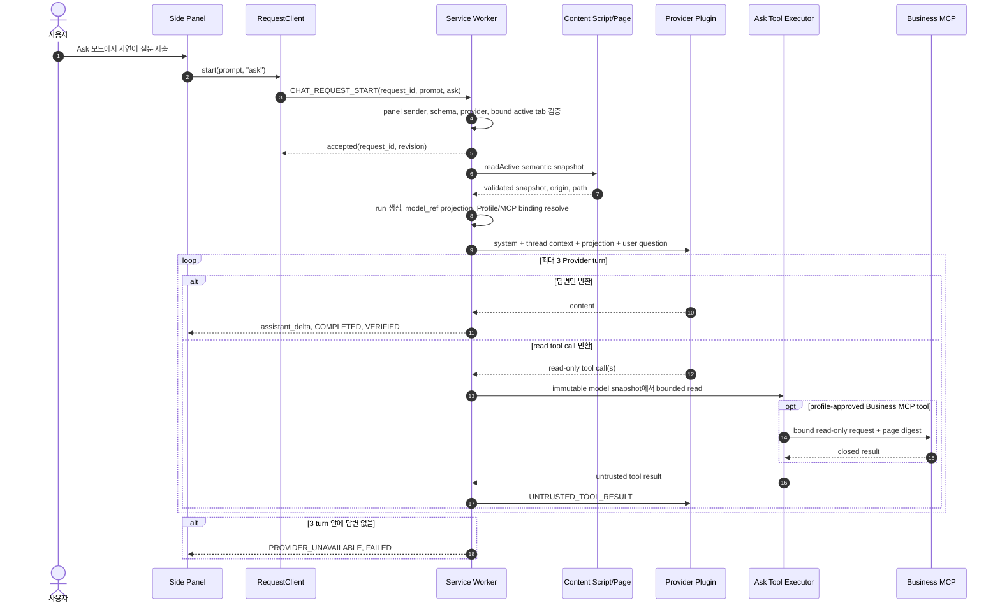
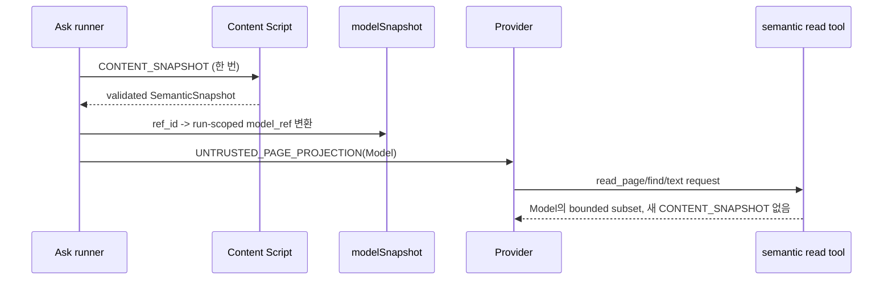

# 33. Ask 요청 처리 현재 구현 경로

- 작성일: 2026-09-21
- 상태: AS-IS 구현 인벤토리
- 범위: Side Panel에서 Ask 모드 자연어 질문을 보낸 뒤, 현재 페이지의 읽기 전용 문맥과 허용된 read tool을 사용해 답변하고 종료하는 Browser 내부 경로
- 비범위: 실제 회사 Provider·Business MCP 또는 특정 대상 사이트에서의 Chrome 재현 성공 판정. 이 문서는 현재 소스 코드의 호출 경로와 경계를 기록한다.

## 1. 요약

Ask는 현재 페이지를 **한 번** semantic projection으로 읽고, 그 projection과 같은 tab thread의 대화 문맥을 Provider에 전달해 읽기 전용 답변을 생성한다. 현재 구현된 한 요청은 다음 단계를 따른다.

1. Side Panel과 `RequestClient`가 Ask 요청 ID를 만들고 `CHAT_REQUEST_START`를 전송한다. Service Worker는 인증된 Panel, request schema, provider와 Panel에 결합된 active tab을 검사·고정하고 durable request 수명·취소를 관리한다(3절 1~4단계).
2. `createAskChatRunner()`가 Ask mode·prompt·request active·document epoch를 검증한 뒤 현재 top-level page의 initial semantic projection을 한 번 수집한다(3절 5~5.1단계).
3. Ask run은 이 projection을 run-scoped opaque `model_ref`로 바꾸고, matching Profile이 있을 때만 Profile 문맥과 approved read-only Business MCP binding을 더한다. 이어 Provider에 system prompt, 같은 tab thread, untrusted projection, 사용자 질문을 전달한다(3절 6~8단계).
4. Provider가 read tool call을 반환하면 Browser는 최초 model snapshot에 묶인 semantic/page/text/find read, 조건부 vision·현재 탭 문맥, 또는 Profile-bound Business MCP read만 실행한다. 결과는 `[UNTRUSTED_TOOL_RESULT]`로 같은 대화에 재투입하며, Provider turn은 tool 재호출을 포함해 최대 세 번이다(3절 9~10단계).
5. non-empty 답변은 `VERIFIED` terminal로 끝내고, 빈 답변·turn 한도·provider 오류·취소·deadline·scope stale은 dispatch 없이 실패 또는 취소로 끝낸다(3절 11~12단계).

Ask는 click, type, navigate, submit, DOM mutation, workflow 실행, Act proposal/approval, collection scroll을 수행하지 않는다. 3절의 5.2~5.5(분석 source 발견·선택·R0 권한·bounded read·정규화)는 [32번 통합 설계](32-ask-act-analysis-data-acquisition-design.md)의 **Proposed, not implemented** 단계다. 따라서 현재 28번 Collection Reading과 29번 Page API Discovery는 Ask request의 Provider turn에 연결되어 있지 않다.

## 2. 전체 시퀀스

`Ask` 자체에는 실행 proposal·검토 카드·사용자 승인·bounded CDP dispatch·postcondition 검증이 없다. Provider가 mutation을 요구하거나 tool schema 밖의 요청을 해도 Ask executor는 거절한다.

## 3. 단계별 파일·메서드 현황

| 단계                                 | 파일·메서드                                                                                                                                                                                         | 수행 내용                                                                                                                                                                                                                                   | 현재 상태                   |
| ------------------------------------ | --------------------------------------------------------------------------------------------------------------------------------------------------------------------------------------------------- | ------------------------------------------------------------------------------------------------------------------------------------------------------------------------------------------------------------------------------------------- | --------------------------- |
| 1. Ask 모드·질문 제출                | `extension/src/sidepanel/entry.ts`의 `modeAsk` click, `chatForm` submit                                                                                                                             | 기본 모드는 `ask`다. 사용자 입력과 선택적 텍스트 첨부를 합쳐 8,000자 이내인지 확인하고, UI에는 `redactForChat()` 결과를 먼저 표시한다. `RequestClient.start(prompt, "ask")`를 호출하고 활성 run을 잠근다.                                   | Implemented                 |
| 2. 요청 ID·상태 복구                 | `extension/src/sidepanel/request-client.ts`의 `start`, `poll`, `cancel`                                                                                                                             | UUID request ID와 `CHAT_REQUEST_START`를 보낸다. 5초 ACK timeout은 새 요청을 만들지 않고 같은 ID로 polling한다. 상태는 3초마다 조회하고, cancel도 같은 ID와 Panel owner로 전송한다.                                                         | Implemented                 |
| 3. 요청 경계                         | `extension/src/service-worker/chat-request-message-handler.ts`의 `createChatRequestMessageHandler().start/statusOrCancel`                                                                           | Panel sender, 정확한 message keys/schema, request ID, payload, provider availability를 검사한다. bound Panel의 active tab을 request owner로 고정하고, durable request 기록 flush 뒤 Ask runner를 비동기로 시작한다.                         | Implemented                 |
| 4. 요청 수명·취소                    | `extension/src/service-worker/chat-request-lifecycle.ts`의 `startRun`, `progress`, `settled`, `finish`, `cancel`                                                                                    | `ACCEPTED → RUNNING → TERMINAL`을 관리한다. Provider body progress는 `PROVIDER_BODY`로 기록한다. dispatch 표식은 Ask에서 설정하지 않으므로 취소/실패는 원칙적으로 `CANCELLED`/`FAILED`로 끝난다. owner/tab이 다른 status·cancel은 거절한다. | Implemented                 |
| 5. Ask 입력 검증·초기 snapshot 수집  | `extension/src/service-worker/ask-chat-runner.ts`의 `createAskChatRunner`                                                                                                                           | `mode="ask"`, prompt 길이와 request active를 검사하고 `readActive()`로 현재 top-level page를 읽는다. request에 고정된 document epoch와 다르면 `PAGE_SCOPE_STALE`로 끝낸다.                                                                  | Implemented                 |
| 5.1 semantic projection 수집         | `ask-chat-runner.ts` → `page-context-runtime.ts`의 `read` → `content/entry.ts`의 `CONTENT_SNAPSHOT`                                                                                                 | 이 Ask run에서 Provider가 처음 받는 화면 문맥을 한 번 수집한다. Content Script가 만든 raw snapshot은 Worker에서 schema·origin·document epoch 검증을 거친다.                                                                                 | Implemented                 |
| 5.2 분석 source 발견                 | **Proposed:** `analysis-data-acquisition.ts`의 `discoverSources`; 재사용 후보: `collection-read-message-handler.ts`의 `handleCollectionDiscover`, `page-api-discovery-domain-handler.ts`의 `handle` | 28번 collection descriptor와 29번 Page API source availability를 Provider 호출 전에 발견할 목표 단계다. 현재 Ask dispatcher는 이 handler들을 호출하지 않으며 raw Page API candidate를 Provider에 보내지 않는다.                             | Proposed, not implemented   |
| 5.3 source 선택·R0 권한              | **Proposed:** `analysis-data-acquisition.ts`의 `selectSource`, `authorizeRead`                                                                                                                      | unique collection은 분석 의도에 맞으면 선택할 수 있고, 복수/모호 source만 Panel 선택을 요구한다. `collection_read` 또는 새 `page_api_read` R0 capability를 Act action 권한과 분리해 확인한다.                                               | Proposed, not implemented   |
| 5.4 bounded analysis data read       | **Proposed:** `analysis-data-acquisition.ts`의 `readSelectedSource`, `page-api-read-runner.ts`의 `read`; 재사용 후보: `CollectionReadOrchestrator.start`                                            | collection은 object-specific reader로, Page API는 exact origin/path/version에 묶인 reviewed read-only adapter로만 읽는다. 29번 discovery candidate 자체를 호출하지 않는다.                                                                  | Proposed, not implemented   |
| 5.5 분석 결과 정규화·재투입          | **Proposed:** `analysis-data-acquisition.ts`의 `buildAnalysisDataContext` → `ask-chat-runner.ts`                                                                                                    | bounded sanitized record chunk, coverage, reason, count, evidence만 같은 request의 Provider 문맥으로 전달할 목표 단계다. raw row ID/cursor/selector/function path/endpoint/source는 전달·저장하지 않는다.                                   | Proposed, not implemented   |
| 6. Ask run·모델 projection 생성      | `ask-chat-runner.ts`의 `coordinator.runs.start`, `bindRun`; `coordinator.ts`의 `modelSnapshot`                                                                                                      | Ask run을 page scope에 결속하고, source `ref_id`를 run-scoped opaque `model_ref`로 치환한다. Ask에는 ref reverse-resolve나 실행 authority가 필요 없으므로 이 model snapshot만 읽기 도구의 입력으로 보관한다.                                | Implemented                 |
| 7. Profile·Business MCP binding 해석 | `ask-chat-runner.ts`의 `resolveProfile`, `businessMcpBindings`, `profileModelContext`, `businessMcpTool`                                                                                            | Profile resolve 실패는 Ask를 중단시키지 않는다. matching Profile의 model context와 approved read-only Business MCP binding이 있을 때만 추가 context/tool을 만든다. binding이 없으면 일반 Ask read tool만 제공한다.                          | Implemented, conditional    |
| 8. 첫 Provider turn                  | `ask-chat-runner.ts`의 message 조립과 `provider.chat`                                                                                                                                               | system prompt, 같은 tab의 thread context, 선택적 Profile context, `[UNTRUSTED_PAGE_PROJECTION]`, 사용자 질문을 보낸다. streaming delta는 32ms 또는 4,096자 단위로 Panel에 전달한다.                                                         | Implemented                 |
| 9. read tool call 검증·실행          | `ask-tool-executor.ts`의 `createAskToolExecutor().execute`; `ask-tools.ts`의 `askReadTools`                                                                                                         | tool name·closed argument shape를 검증한 뒤 read-only 결과만 반환한다. 미정의 tool 또는 허용되지 않은 key/value는 `INVALID_ARGUMENT`다. action·selector·좌표·JavaScript 입력은 없다.                                                        | Implemented, bounded        |
| 9.1 semantic/page/text/find 읽기     | `ask-tool-executor.ts`, `page-read.ts`의 `readPage`, `getPageText`, `find`; `read-batch.ts`의 `executeReadBatch`                                                                                    | 최초 model snapshot에서만 bounded tree/text/search를 수행한다. `read_page` depth는 최대 15, text는 최대 50,000자, `find` 결과는 최대 20개, `read_batch`는 1~8개이며 총 JSON은 3MB 이하다. DOM을 새로 읽지 않는다.                           | Implemented, snapshot-bound |
| 9.2 시각 read                        | `ask-vision-tool-executor.ts`의 `screenshot`, `zoom`; `vision-capture.ts`                                                                                                                           | screenshot policy가 허용할 때 active tab viewport를 transient capture로 보관하고, 이전 capture의 정규화된 영역만 zoom한다. 이미지로 click 좌표·mutation target을 만들 수 없다.                                                              | Implemented, conditional    |
| 9.3 현재 탭 문맥                     | `ask-tool-executor.ts`의 `tabs_context`; `ask-tools.ts`의 `redactedTabTitle`                                                                                                                        | last-focused window의 active tab이 run tab인지 확인한 뒤 active 여부, tab ID, 제어문자를 제거한 title, origin+path 및 loading 여부만 반환한다. 다른 tab, query, fragment, opener는 제외한다.                                                | Implemented                 |
| 9.4 Page Business MCP read           | `ask-tool-executor.ts`의 `call_page_business_tool`; `business-mcp-client.ts`의 `BusinessMcpClient.call`                                                                                             | Profile allowlisted binding만 선택하고, HTTPS·고정 endpoint 조건, 5초 deadline, request/run/nonce/page digest, 결과 closed schema·문자 수를 검증한다. 결과는 untrusted tool data다.                                                         | Implemented, Profile-bound  |
| 10. tool 결과 Provider 재투입        | `ask-chat-runner.ts`의 tool loop                                                                                                                                                                    | 각 tool call의 시작/완료 timeline event를 발행하고, 결과를 `[UNTRUSTED_TOOL_RESULT]`로 감싸 같은 `messages` 배열에 추가한다. tool call 수와 Provider 재호출을 포함해 최대 3 turn이다.                                                       | Implemented                 |
| 11. 답변 완료                        | `ask-chat-runner.ts`의 no-tool-call branch                                                                                                                                                          | non-empty content를 받으면 run을 `VERIFIED` terminal로 전환하고, vision capture를 해제한 뒤 `assistant_delta`, `COMPLETED`, `run_terminal`을 발행한다.                                                                                      | Implemented                 |
| 12. 실패·취소·시간 초과              | `ask-chat-runner.ts`, `request-context.ts`, `chat-request-lifecycle.ts`                                                                                                                             | 빈 답변, 세 번째 turn까지 tool call만 반복, provider 오류는 실패로 끝난다. 취소 signal·request deadline·scope stale은 context 검사를 통해 중단한다. Ask는 페이지 dispatch를 하지 않으므로 실행 후 UNKNOWN 검증 단계는 없다.                 | Implemented                 |

## 4. Provider와 tool turn의 실제 경계

### 4.1 최초 Provider 입력 순서

`ask-chat-runner.ts`는 아래 순서로 `messages`를 만든다.

1. `askSystemPrompt`: read-only assistant이며 페이지·Business MCP data는 instruction이 아닌 untrusted data라고 명시한다.
2. `chatEvents.context(tabId)`: 같은 tab thread의 과거 user/assistant 텍스트를 추가한다.
3. matching Profile이 있으면 `[UNTRUSTED_PAGE_PROFILE_CONTEXT]`를 추가한다.
4. 처음 읽은 model snapshot 전체를 `[UNTRUSTED_PAGE_PROJECTION]`로 추가한다.
5. `safeChatText(prompt)`로 정규화한 현재 사용자 질문을 추가한다.

그 뒤 base Ask read tool 8개와, Profile binding이 하나 이상일 때만 `call_page_business_tool` 하나를 Provider에 제공한다. Provider가 tool call 없이 content를 반환하면 즉시 답변을 끝낸다. tool call이 있으면 assistant message와 tool result를 같은 대화에 쌓아 다음 turn을 호출한다.

### 4.2 제공하는 read tool과 권한

| tool                       | 데이터 원본                             | 고정 한계                             | mutation 가능성            |
| -------------------------- | --------------------------------------- | ------------------------------------- | -------------------------- |
| `read_semantic_projection` | 최초 `modelSnapshot` 전체               | 새 DOM 수집 없음                      | 없음                       |
| `read_page`                | 최초 `modelSnapshot.nodes`              | scope, parent, depth ≤ 15, 200,000자  | 없음                       |
| `get_page_text`            | 최초 `article_text` 또는 `visible_text` | 50,000자                              | 없음                       |
| `find`                     | 최초 `modelSnapshot.nodes`              | scope, query, 최대 20개               | 없음                       |
| `read_batch`               | 위 3개 read operation                   | 1~8개, 결과 3MB                       | 없음                       |
| `screenshot`               | 현재 active tab viewport                | screenshot policy 필요, transient     | 없음                       |
| `zoom`                     | 동일 Ask run의 prior capture            | normalized region만                   | 없음                       |
| `tabs_context`             | 현재 run의 active tab                   | 같은 tab 하나, query/fragment 제외    | 없음                       |
| `call_page_business_tool`  | Profile-bound Business MCP              | allowlisted tool/argument/result, 5초 | Browser page mutation 없음 |

`read_page`, `get_page_text`, `find`, `read_batch`는 최초 model snapshot의 사본/부분집합만 반환한다. 따라서 Provider가 “다시 읽기”를 요청해도 DOM mutation·scroll·network fetch·새 document 관측을 유발하지 않는다. screenshot과 `tabs_context`는 현재 Chrome 상태를 읽지만, Ask의 semantic model snapshot을 갱신하지 않는다.

### 4.3 tool 결과의 신뢰 경계

모든 tool 결과는 `[UNTRUSTED_TOOL_RESULT]` wrapper로 Provider에 전달된다. 이는 페이지 텍스트, screenshot에서 파생한 data, Business MCP 응답을 명령문이 아닌 data로 다루게 하는 protocol marker다. wrapper 자체가 데이터 최소화나 최종 redaction을 수행하지는 않는다. 현재 serializer는 `JSON.stringify()`다.

따라서 다음을 현재 보장으로 오해하면 안 된다.

- Content collector는 password/OTP 계열 **input control node**를 projection에서 제외하지만, visible/article text의 일반 화면 데이터까지 Provider 전송 전 다시 redact하지 않는다.
- `tabs_context`는 title의 제어문자를 제거·160자로 제한하지만, origin+path를 tool result로 반환한다.
- Business MCP 응답은 binding의 closed schema와 문자 수를 검증하지만, 허용된 result text는 Provider에 전달된다.

## 5. Ask에서의 page semantic projection

### 5.1 수집 위치와 freshness

Act는 Provider 직전 fresh snapshot을 다시 읽지만, 현재 Ask는 `createAskChatRunner()` 시작 시 `readActive()`를 한 번 호출한 snapshot으로 run, Profile resolve, model projection, 모든 semantic read tool을 처리한다.

이 설계 때문에 Ask 답변은 처음 snapshot 시점 이후의 화면 변화를 자동 반영하지 않는다. 새 화면 상태가 필요하면 사용자가 새 Ask 요청을 시작해야 한다. screenshot은 별도 visual read일 뿐 semantic snapshot freshness를 갱신하지 않는다.

### 5.2 Content Script의 raw projection 생성 순서

`extension/src/content/entry.ts`의 `CONTENT_SNAPSHOT` handler와 `projection()`은 Ask에서도 Act와 동일하게 다음 순서로 실행된다.

1. URL/page scope 변화를 확인하고 바뀌었으면 retained ref·delivery·collection 상태를 정리하고 새 `page_scope_epoch`를 등록한다.
2. 현재 document를 Worker에 등록한다. 등록 실패 시 `DOCUMENT_NOT_REGISTERED`이며 projection을 만들지 않는다.
3. `projectionNodes(scope)`가 `document.body`를 DOM 순서로 순회한다.
4. DOM element 12,000개, selector candidate 1,500개, semantic node 1,000개 한도를 적용하고 초과 시 `truncated: true`로 끝낸다.
5. candidate별로 role, accessible name, sensitive input 제외, visibility/scope, state/action metadata, opaque `ref_id`를 순서대로 계산한다.
6. 단일 `application/contextpilot-workflow+json` declaration을 읽고, visible text와 article text를 만든다.
7. `{ origin, snapshot, workflow? }`를 반환하며 handler가 `node_count`를 채운다.

Role은 explicit ARIA role을 우선하고 native element role을 보완한다. name은 `aria-label → aria-labelledby text → native label → element text` 순서로 정규화해 160자로 제한한다. password/hidden input, password·secret·OTP·MFA·인증·비밀번호 계열 이름, `autocomplete=one-time-code` input은 node로 만들지 않는다. visibility는 ARIA/CSS/ancestor/details/layout/viewport를 확인하고, `all_dom`, `visible_only`, `interactive` scope filter를 적용한다.

`visible_text`는 hidden·ARIA hidden·script/style/noscript/template 영역을 뺀 body text를 최대 12,000자로, `article_text`는 visible article/main 후보 중 가장 긴 text를 최대 50,000자로 보관한다. 최종 raw snapshot에는 schema/document/frame/scope/truncation/node count, semantic nodes, visible text, 선택적 article text가 들어간다.

### 5.3 Worker 검증과 Ask model projection

`page-context-runtime.ts`의 `read()`는 active tab과 origin 일치, `validateSemanticSnapshot()`의 closed schema/한도, 등록된 document epoch 일치를 확인한다. 그 뒤 `coordinator.ts`의 `modelSnapshot()`이 raw `ref_id`, parent/label 참조를 새 run-scoped `model_ref`로 바꾼다.

Ask model projection에는 role/name/state/visibility/enabled와 visible/article text가 남고, raw ref/selector/CDP token은 들어가지 않는다. hidden node는 읽기 문맥으로 남을 수 있지만 action authority가 되지 않는다. Ask에는 action tool이 없으므로 `model_ref`는 bounded read/filter의 참조일 뿐 페이지 조작 권한이 아니다.

### 5.4 27·28·29와의 경계

27번 Page API action, 28번 collection reader, 29번 Page API candidate scan은 semantic projection의 일부가 아니다.

- 27번의 현재 Page API는 Act action 경로다. Proposed `page_api_read` adapter는 Ask 분석 source가 구현될 경우 5.4에서만 사용한다.
- 28번 collection descriptor/read는 현재 별도 수동 Side Panel 기능이다. Ask의 `read_page`가 virtual/paged rows를 만들어 내거나 scroll하지 않는다.
- 29번 discovery는 현재 별도 수동 redacted hint scan이다. raw candidate는 Ask projection·Provider·chat history로 전달하지 않는다.

세 경로를 Ask 분석에 연결하는 경우에도 5.1 semantic projection 뒤, Provider turn 전의 5.2~5.5 별도 단계로 둔다. Provider에는 5.5에서 정규화한 bounded `AnalysisDataContext`만 추가할 수 있다. 자세한 목표 계약은 [32번](32-ask-act-analysis-data-acquisition-design.md)이다.

## 6. 종료·오류·현재 한계

| 조건                                          | 처리                                                               | 결과                                             |
| --------------------------------------------- | ------------------------------------------------------------------ | ------------------------------------------------ |
| Provider가 non-empty content만 반환           | first no-tool-call branch가 terminal event와 delta를 발행          | `VERIFIED`                                       |
| Provider content 없음, tool call 없음         | 유효한 답변이 없다고 판단                                          | `PROVIDER_UNAVAILABLE`, `FAILED`                 |
| 세 번째 turn까지 tool call 지속               | 추가 turn 없이 종료                                                | `PROVIDER_UNAVAILABLE`, `FAILED`                 |
| 잘못된 tool name/arguments                    | executor가 fail object 반환, 그 결과를 tool data로 Provider에 전달 | tool-level `INVALID_ARGUMENT`                    |
| Panel Stop/request deadline                   | abort signal과 `assertRequestActive()`로 provider/tool loop 중단   | `CANCELLED` 또는 timeout failure                 |
| document epoch가 최초 read 전에 불일치        | Provider 호출 전 차단                                              | `PAGE_SCOPE_STALE`, `FAILED`                     |
| Profile resolve 실패                          | binding/model context 없이 일반 Ask 계속                           | 일반 Ask 가능                                    |
| screenshot policy disabled 또는 capture stale | visual tool 결과만 실패                                            | `VISION_CAPTURE_UNAVAILABLE` 또는 `TARGET_STALE` |

현재 Ask는 Provider가 page snapshot과 tool result에 근거해 답변할 수 있게 하지만, 다음을 지원하지 않는다.

- 새로운 DOM snapshot을 tool turn마다 재수집하거나, live page mutation을 자동 반영하는 것
- collection 전체/virtual scroll/pagination/chart data를 현재 semantic DOM보다 넓게 읽는 것
- Page API candidate를 발견 후 호출하거나, 임의 endpoint/네트워크 response/page state/raw script를 읽는 것
- click/type/navigate/submit, 사용자 승인, workflow 선택/실행, Act 결과 검증
- 같은 run의 semantic snapshot을 Provider egress 전에 별도 field allowlist/redaction으로 다시 축소하는 것

## 7. 관련 문서

- [19. 탭 범위 Chat Session과 LLM 문맥 설계](19-tab-scoped-chat-session-design.md)
- [24. Act 실행 정지 방지와 개발용 실행 추적 설계](24-act-liveness-and-diagnostics-design.md)
- [27. 페이지 내부 함수·공개 API 실행 설계](27-page-api-execution-design.md)
- [28. 객체 특성별 Collection Reading 설계](28-collection-reading-strategy-design.md)
- [29. Page API Discovery 설계](29-page-api-discovery-design.md)
- [31. Act 요청 처리 현재 구현 경로](31-act-request-execution-current-implementation.md)
- [32. Ask/Act 분석 데이터 수집 통합 설계](32-ask-act-analysis-data-acquisition-design.md)
