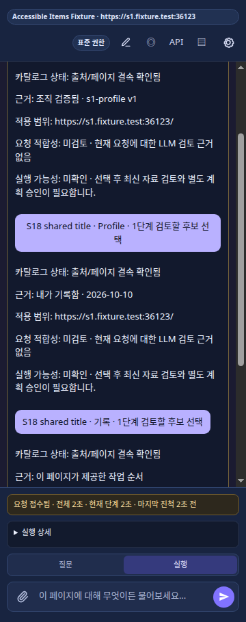

# 워크플로우 후보 상태 표시 — 2026-10-10

## 범위와 결과

[설계 §8.1–8.2](../34-page-act-context-harness-design.md)의 후보 상태 표시를 작은 Browser-local 항목으로 구현했다. S20 이후 새 Sprint 번호를 부여하거나 전체 워크플로우 검토 설계의 완료를 선언하지 않는다.

선택 화면은 후보별 카탈로그 상태, 기존 검증 근거, origin/path 적용 범위를 표시한다. 카탈로그의 `verified`를 요청 적합성이나 실행 승인으로 표시하지 않는다. 현재 화면에는 선택 전 LLM 검토 결과가 없으므로 적합성은 `미검토`, 실행 가능성은 `미확인`으로 표시한다. `stale`/`incomparable` 후보의 선택 차단은 유지한다.

선택 버튼을 `N단계 실행`에서 `N단계 검토할 후보 선택`으로 변경했다. 선택 이후 원본 읽기, 최신 자료를 이용한 LLM 재검토, 계획 및 동작 승인 흐름은 유지한다. 상세 정보는 `textContent`로 렌더링한다.

## 실행한 검증

- `pnpm typecheck`, `pnpm lint`, `pnpm check:module-boundaries`: PASS.
- 버전 변경 없는 TypeScript 빌드, extension 번들, package 검증: PASS. 버전 `0.1.98` 유지.
- `pnpm test:unit`: 151 files / 703 tests PASS.
- `pnpm test:chrome-s18`: controlled provider, 실제 Chrome Side Panel의 저장/Profile/페이지 제공 후보 match/mismatch 6/6 PASS. 후보 근거 표시 및 선택 이후 원본 전체 읽기/LLM 검토 흐름을 확인했다.
- 이전 대화 카드를 검사하지 않도록 현재 선택 카드 식별자를 추가한 뒤 `ACCESSIBLE_ITEMS_CASES=s18-saved-match pnpm test:chrome-s18`를 재실행: 1/1 PASS. 위 스크린샷은 이 최종 코드 실행에서 수집했다.
- `git diff --check`: PASS. 신규 TS/검증 모듈은 각각 199줄 이하. 기존 oversized 파일의 전체 source-size 기준 문제는 이번 항목에서 해결하지 않았다.

## 남은 개발

후보 선택 **전** 모든 후보에 대해 원본/현재 UI/필요한 코드와 실제 capability를 읽고 모델이 적합성을 검토하는 흐름은 아직 구현되지 않았다. 선택 화면의 후보별 `match`/`partial`/`mismatch`/`needs_context`, evidence coverage, 원본 대비 변경 초안과 대안 표시는 이 검토 결과의 계약과 함께 구현해야 한다. 현재의 미검토 안내를 그 완료 증거로 사용하지 않는다.

일반 UI/handler에서 LLM이 생성한 계획을 후보 선택에 통합하는 항목도 남아 있다. 이 변경에는 provider 실행 경로 변경이 없으며 live-provider, 실제 사이트, Platform/Enterprise 또는 릴리스 검증을 주장하지 않는다.
