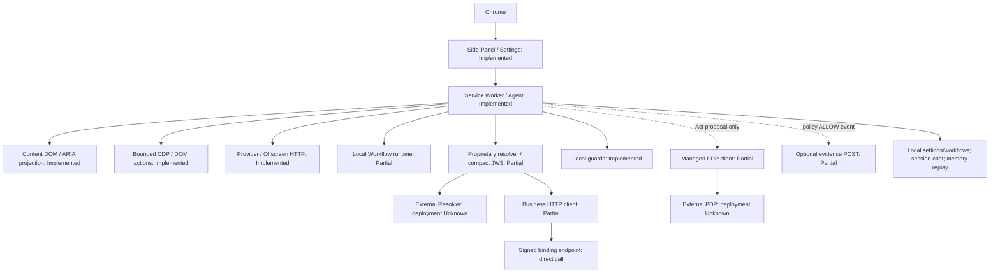
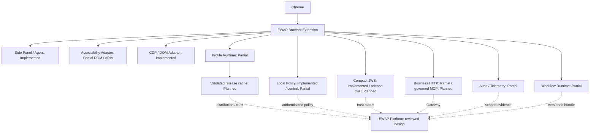

# EWAP Browser — Platform Alignment

## 1. Alignment scope

Reviewed on 2026-09-06. This is a documentation-only assessment. “Implemented” means code and its call path were inspected; it does not mean tests were rerun or production qualification was obtained.

| Baseline       | Reviewed revision and sources                                                                                                                                                                                                                                                                                                                                                                                                                  | Authority                                                                                                                                           |
| -------------- | ---------------------------------------------------------------------------------------------------------------------------------------------------------------------------------------------------------------------------------------------------------------------------------------------------------------------------------------------------------------------------------------------------------------------------------------------- | --------------------------------------------------------------------------------------------------------------------------------------------------- |
| ewap-workspace | `d3e5768fea81ad8a240217375e731163416330ee`; [architecture](../../ewap-workspace/ARCHITECTURE.md), [contracts](../../ewap-workspace/CONTRACTS.md), [schemas](../../ewap-workspace/specs/README.md)                                                                                                                                                                                                                                              | Shared contracts take priority; unchanged in this task                                                                                              |
| ewap-platform  | `d579978dff2b37899f8f987d1338a68421af6c21`; [application design](../../ewap-platform/docs/aidlc/inception/application-design.md), [resource/API](../../ewap-platform/docs/aidlc/contracts/resource-api.md), [release/trust](../../ewap-platform/docs/aidlc/contracts/release-trust.md), [evidence/jobs](../../ewap-platform/docs/aidlc/contracts/evidence-jobs.md), [change/impact](../../ewap-platform/docs/aidlc/contracts/change-impact.md) | Current design for Platform-owned behavior; the [state ledger](../../ewap-platform/docs/aidlc/aidlc-state.md) is Proposed, not implemented services |
| ewap-browser   | `2c3b337b9b7da4a7d87858c43152fe0b422009ef`; manifest `0.1.27`                                                                                                                                                                                                                                                                                                                                                                                  | Actual source, configuration, existing unit tests and design documents                                                                              |

Resolve inconsistencies in this order: **workspace contracts → Platform design for Platform-owned behavior → actual Browser implementation → existing Browser design**. Conflicts between workspace schemas and Platform proposals remain contract gaps in §8. Do not silently adopt the Platform wire format instead of `ewap/v1`. Preserve Browser names such as ContextPilot, R0–R3 and Service Worker when their meanings remain appropriate.

Target/Planned below describes a design recommendation, not approval to implement or release. Workspace [compatibility records](../../ewap-workspace/compatibility/compatibility.yaml) contain unknown product versions; listing `ewap/v1` there is not consumer conformance evidence.

## 2. Current Browser architecture

### 2.1 AS-IS inventory

Classification vocabulary: `Implemented`, `Partially Implemented`, `Designed Only`, `Missing`, `Deprecated`, `Unknown`. Local functionality and Platform integration are evaluated separately.

| Component                                    | Classification        | Observed behavior and evidence                                                                                                                                                                                                                                                                                                                |
| -------------------------------------------- | --------------------- | --------------------------------------------------------------------------------------------------------------------------------------------------------------------------------------------------------------------------------------------------------------------------------------------------------------------------------------------- |
| Chrome Extension                             | Implemented           | [Manifest](../extension/manifest.json): MV3, minimum Chrome 116, Side Panel, debugger, offscreen, optional scripting                                                                                                                                                                                                                          |
| Background / Service Worker                  | Implemented           | [Bootstrap](../extension/src/service-worker/bootstrap.ts), [registration](../extension/src/service-worker/runtime-registration.ts): composition, routing, tab/document/run lifecycle                                                                                                                                                          |
| Content scripts                              | Implemented           | [Entry](../extension/src/content/entry.ts), [collector](../extension/src/content/semantic-collector.ts): DOM-derived roles/names/states/visibility, document refs and preflight                                                                                                                                                               |
| Side Panel / Settings                        | Implemented           | [Panel](../extension/src/sidepanel/panel.ts), [settings](../extension/src/settings/entry.ts): Ask/Act, review, permission, confirmation and local provider settings                                                                                                                                                                           |
| Accessibility Adapter                        | Partially Implemented | DOM/ARIA semantic projection exists. No native Chrome AX tree acquisition or CDP `Accessibility.*` path was found; do not claim full AX integration                                                                                                                                                                                           |
| CDP / DOM Adapter                            | Implemented           | [Bounded CDP](../extension/src/cdp/bounded-adapter.ts), [execution routing](../extension/src/service-worker/act-execution-runtime.ts), [DOM executor](../extension/src/content/executor.ts). Current click/key/text path uses CDP; other tools use content execution. [Vision](../extension/src/service-worker/vision-capture.ts) is separate |
| Agent Runtime                                | Implemented           | [Ask](../extension/src/service-worker/ask-chat-runner.ts), [Act](../extension/src/service-worker/act-chat-start.ts): model tool loop, page-derived candidates and action review/verifier                                                                                                                                                      |
| Page Profile Runtime                         | Partially Implemented | [Resolver](../extension/src/profile/resolver.ts), [claims](../extension/src/profile/profile.ts): proprietary v1 compact JWS, context/action/workflow/MCP consumption; no `ewap/v1` loader                                                                                                                                                     |
| Workflow Runtime                             | Partially Implemented | [Declaration](../extension/src/contracts/workflow.ts), [catalog](../extension/src/service-worker/workflow-catalog-runtime.ts), [step runner](../extension/src/service-worker/act-step-runner.ts): up to 12 steps, three UI tools, local/profile/page candidates; no Platform WorkflowDefinition consumer                                      |
| Business MCP Client                          | Partially Implemented | [Client](../extension/src/profile/business-mcp-client.ts): proprietary HTTPS POST to the signed binding endpoint. No standard MCP initialize/discovery/streamable-http/SSE/stdio client                                                                                                                                                       |
| Local profile cache                          | Missing               | [Page context](../extension/src/service-worker/page-context-runtime.ts) fetches on resolve. No persistent Profile artifact cache. [Replay store](../extension/src/profile/profile-replay.ts) is a worker-memory Map                                                                                                                           |
| Local policy enforcement                     | Implemented           | [Permission modes](../extension/src/policy/permission-mode.ts), [mutation coordinator](../extension/src/state/mutation-coordinator.ts), [preflight](../extension/src/content/preflight.ts): capability/host, target/value/confirmation/verifier boundaries                                                                                    |
| Enterprise policy integration                | Partially Implemented | [Client](../extension/src/policy/enterprise-policy.ts), [Act call site](../extension/src/service-worker/act-proposal-executor.ts): managed-config ALLOW/DENY query; no EnterprisePolicy resource consumer or complete dispatch coverage                                                                                                       |
| Enterprise authentication                    | Missing               | Managed identity strings are put in the request body. No runtime OAuth/OIDC access token acquisition/refresh or authenticated issuer/audience binding. Website login and LLM API keys are separate                                                                                                                                            |
| Profile signature verification               | Implemented           | [JWS](../extension/src/profile/jws.ts): compact ES256/P-256, local public-key ring and dedicated typ. Platform SignedRelease verification is missing                                                                                                                                                                                          |
| Telemetry / audit                            | Partially Implemented | [Sink](../extension/src/service-worker/runtime-evidence.ts), [audit](../extension/src/security/audit.ts): optional best-effort POST, limited policy emission. [Chat events](../extension/src/service-worker/chat-run-lifecycle.ts) are a separate UI stream                                                                                   |
| Configuration                                | Partially Implemented | Provider/Profile Resolver settings use storage.local. Managed reads for enterprise_policy/identity/runtime_evidence are constrained by the manifest managed schema, but force-install, verified identity and release/trust configuration remain incomplete                                                                                    |
| Error handling                               | Partially Implemented | [ContractError](../extension/src/security/validation.ts), terminal/UNKNOWN outcomes and no automatic mutation retry. No Platform error envelope/correlation mapping or audit delivery failure handling                                                                                                                                        |
| Change / Impact helpers                      | Implemented           | [semantic-impact](../extension/src/studio/semantic-impact.ts), [validation](../extension/src/studio/validation.ts): simple functions used by unit tests, with no production call site; not Platform services                                                                                                                                  |
| Platform capture/trust/compatibility clients | Designed Only         | Target responsibilities defined below; authenticated capture ingest, trust epochs and supported-version negotiation are absent                                                                                                                                                                                                                |
| Git-authoritative Provider proposal          | Deprecated            | Older external Git authoring/management MCP design; not Browser implementation. Platform target uses DB authority and redacted Git export                                                                                                                                                                                                     |
| Deployed Registry/Gateway/PDP                | Unknown               | Configured external services were not contacted. Platform checkout contains design documents, not service implementations                                                                                                                                                                                                                     |

### 2.2 AS-IS diagram

External endpoints are not evidence of implemented Platform services. Browser does not distinguish or enforce whether the configured business endpoint is a Gateway or a direct server.

### 2.3 Platform responsibilities translated to Browser

| Platform capability / design source                                                                         | Browser-side Target responsibility                                                                                    | Current integration              |
| ----------------------------------------------------------------------------------------------------------- | --------------------------------------------------------------------------------------------------------------------- | -------------------------------- |
| Profile Service / Repository: [Manager](../../ewap-platform/docs/aidlc/modules/profile-manager-registry.md) | Resolve, retrieve and verify active releases; no source editing or approval API                                       | Proprietary Resolver only        |
| Profile Studio / [Builder](../../ewap-platform/docs/aidlc/modules/profile-builder.md)                       | Consent to scoped capture; supply sanitized observations                                                              | Local collection only; no ingest |
| Profile distribution / releases                                                                             | Validate and atomically activate the Profile/Workflow dependency bundle                                               | Signed Profile response only     |
| [MCP Gateway / Registry](../../ewap-platform/docs/aidlc/modules/mcp-registry-gateway.md)                    | Governed routing, release/tool allow-list and runtime authentication; Platform owns catalog discovery and credentials | Direct proprietary POST          |
| Policy / [Governance](../../ewap-platform/docs/aidlc/modules/governance-trust-release.md)                   | Add organizational restrictions to local guards; handle pre-action deny and approval                                  | PDP query on part of Act flow    |
| Signing / trust                                                                                             | Verify distributed signatures and current trust; no private keys or signing                                           | Compact verifier, local key ring |
| Audit Service                                                                                               | Authenticated event delivery, receipts and visible delivery failures                                                  | Optional policy-event POST       |
| [Change Detector](../../ewap-platform/docs/aidlc/modules/change-detector.md)                                | Supply scoped, complete observations and mismatches; no baseline/classification ownership                             | Local fingerprint only           |
| [Impact Analyzer](../../ewap-platform/docs/aidlc/modules/impact-analyzer.md)                                | Supply release/workflow/step outcomes; no graph/score ownership                                                       | Test-only helper; no integration |
| Authentication / authorization                                                                              | Runtime audience identity, token expiry/refresh and organization/environment binding                                  | Managed identity strings only    |
| Versioning / compatibility management                                                                       | Declare supported API, transport and step subsets; reject unsupported releases                                        | No negotiation                   |

### 2.4 Pre-edit AS-IS / TO-BE assessment

This classification preceded editing the existing documents and determines the corrections in §4 and future tasks in §9.

| Area                   | Browser AS-IS                           | Browser Existing Design                            | Platform / Contract Requirement                   | Assessment                 | Design Action                                             |
| ---------------------- | --------------------------------------- | -------------------------------------------------- | ------------------------------------------------- | -------------------------- | --------------------------------------------------------- |
| MV3/local guards       | Run/document boundaries exist           | Browser-owned                                      | Workspace execution plane                         | ALIGNED                    | Preserve                                                  |
| Names/local experience | ContextPilot, R0–R3, plugins            | Local and enterprise scopes mixed                  | Platform identity is a separate boundary          | INTENTIONAL_BROWSER_DESIGN | Preserve names; distinguish modes                         |
| Accessibility          | DOM/ARIA projection                     | Can imply full AX                                  | Observation adapter                               | DOCUMENTATION_GAP          | Identify native AX as absent                              |
| Profile authority      | External Resolver consumer              | Git source of truth                                | Platform DB authority                             | DEPRECATED_DESIGN          | Replace target ownership; retain legacy context           |
| Resource shapes        | schema_version 1                        | Proprietary/enterprise mixed                       | Workspace ewap/v1 conflicts with Platform alpha   | CONTRACT_GAP               | C01–C04; no assumed conversion                            |
| Signature              | Compact ES256 exists                    | Generic signed Profile wording                     | Flattened SignedRelease                           | IMPLEMENTATION_GAP         | Separate current verifier and future release support      |
| Cache/trust            | Memory replay only                      | Cache/revoke listed as ports                       | Expiry/current trust/rollback                     | DESIGN_GAP                 | Specify lifecycle, invalidation and failure behavior      |
| MCP payload            | Closed business_mcp                     | Additional catalog/release fields appear supported | Exact frozen metadata                             | DOCUMENTATION_GAP          | List actual accepted fields                               |
| MCP transport          | Direct proprietary HTTPS                | Discovery/Gateway in present tense                 | PROD Gateway; shared transport enum               | CONTRACT_GAP               | Explicit modes and C03                                    |
| MCP freshness          | Initial snapshot/JWS reused             | Fresh check before every call                      | Dispatch-time trust/PDP/binding                   | IMPLEMENTATION_GAP         | Future P1 task                                            |
| Policy                 | ALLOW/DENY on Act proposal              | Full SSO/RBAC/PDP chain                            | Authenticated subject, REQUIRE_APPROVAL, expiry   | IMPLEMENTATION_GAP         | Specify coverage and resume gaps                          |
| Profile failure        | Generic Ask/Act may continue            | Mixed fail-closed claims                           | Organizational policy determines required Profile | DESIGN_GAP                 | Separate optional current mode and required target routes |
| Workflow               | 12 UI steps, inline                     | Local declaration                                  | Shared Workflow vs Platform WorkflowDefinition    | CONTRACT_GAP               | Versioned subset and migration                            |
| Audit                  | UI stream + optional policy POST        | Complete central envelope                          | Authenticated durable ingest                      | IMPLEMENTATION_GAP         | Event matrix and receipt/failure design                   |
| Diagnostics            | Console URL/snapshot/model messages     | Blanket raw-content prohibition                    | Sanitized evidence/privacy                        | ARCHITECTURAL_DEVIATION    | Record current exposure and remediation task              |
| Change/Impact          | Test-only studio helpers                | Enterprise foundations in Browser                  | Platform analysis ownership                       | ARCHITECTURAL_DEVIATION    | Non-authoritative helpers; future ownership decision      |
| Fingerprint            | semantic-projection-fp-v1               | Broad semantic baseline claim                      | Platform semantic-v1                              | CONTRACT_GAP               | Distinct algorithms, versioned observations               |
| UNKNOWN                | Some paths reduce uncertainty to FAILED | All uncertain dispatches described as UNKNOWN      | Preserve uncertain outcome, no automatic retry    | IMPLEMENTATION_GAP         | Future outcome-mapping validation                         |

## 3. Already aligned

Keep the MV3 execution plane, Service Worker coordination, visible/enabled target restriction, opaque model references, local permission/confirmation/verifier guards, exclusion of credentials from model inputs, and untrusted treatment of MCP results. A Profile cannot create an unobserved target. Existing signature verification, closed tool bindings and sequential local workflows should be reused where compatible; Platform envelopes, authentication and lifecycle remain additional work.

Policy authority and observed page truth are separate axes. Platform policy can restrict an action but cannot make a missing or non-actionable DOM target valid. Browser observations cannot override central deny.

## 4. Documentation gaps fixed

- [01 architecture](01-architecture.md): distinguish local AS-IS, Platform TO-BE, missing native AX and actual CDP routing.
- [02 security](02-security-policy.md): define policy ownership, actual PDP coverage and missing identity/approval integration.
- [03 extension](03-extension-design.md): classify integration ports and remove Browser ownership of Registry discovery.
- [06 audit/privacy](06-data-audit-and-privacy.md): separate actual emissions/Console from planned audit; disclose diagnostic gaps.
- [13 tools](13-site-tool-contract.md): distinguish direct HTTP, target Gateway, tool allow-list and missing freshness enforcement.
- [14 projection](14-semantic-projection-fingerprint.md): separate Browser fingerprint and Platform semantic-v1.
- [21 workflow](21-declarative-act-workflow-design.md): distinguish local runtime from shared/Platform resources.
- [22 profile/distribution](22-page-profile-provider-design.md): correct DB authority and document Profile/signature/cache/compatibility lifecycle.
- [Index](README.md): link this assessment and explain current versus target scope. Historical sprint evidence remains unchanged.

## 5. Design gaps

### Target aligned architecture

Target loading: `Platform Repository → Distribution → Browser Loader → Schema Validation → Signature Verification → Policy Validation → Local Cache → Profile Runtime`. Pre-signature schema checks inspect untrusted shape only; activation requires signature, claims and current trust. Stage status and current ordering are detailed in [22](22-page-profile-provider-design.md).

A Profile-required route must reject new execution when its artifact is invalid, expired, revoked or unsupported. Optional community routes may retain generic Ask/Act under local guards. Required-route selection and behavior when managed configuration is missing need a versioned policy/managed contract; the current community default is not enterprise admission control.

### Change Detector / Impact Analyzer relationship

Platform owns baselines, change classification, dependency graphs, impact scoring and revalidation/promotion decisions. Browser supplies authorized page metadata, DOM/ARIA observations, Profile mismatches, workflow/action failures and verifier outcomes. Native AX observations are a planned input only if that adapter is introduced.

Runtime metadata uses the telemetry audience; capture snapshots use a separate short-lived capture-session audience. Bind observations to release/workflow/step, algorithm/sanitization version, scope and completeness. Exclude raw URL/query, HTML, selectors/refs/nodes/coordinates, input values and secrets. Partial frames or incompatible algorithms mean INCOMPARABLE, not “no change.” Shared capture/telemetry schemas remain C06/C07.

Keep `extension/src/studio/*` visible in AS-IS without assigning Platform services to Browser. Its boolean `validateStudio` L0–L6 mapping does not match Platform L0 schema/L1 references/L2 semantics/L3 security/L4 simulation/L5 Chrome/L6 operations and is not release evidence.

## 6. Implementation gaps

All items are future work only.

| Priority                              | Gap                                                                                       | Required boundary                                              |
| ------------------------------------- | ----------------------------------------------------------------------------------------- | -------------------------------------------------------------- |
| P0 — compatibility requirement        | Versioned PageProfile/Workflow/Policy/McpServer mapping                                   | Resolve C01–C04; no implicit conversion                        |
| P0 — compatibility requirement        | Compact Profile vs flattened SignedRelease envelope/digest/claims                         | C05; never rewrite already-signed bytes                        |
| P0 — compatibility requirement        | Supported transport/step/risk/error/extension semantics                                   | Reject unsupported features; x- cannot increase authority      |
| P1 — Platform integration requirement | Runtime authentication, managed deployment schema, organization/environment binding       | Local strings are not SSO proof                                |
| P1 — Platform integration requirement | Trust/revoke, cache/expiry/rollback, persistent anti-replay                               | Include worker restart and offline admission                   |
| P1 — Platform integration requirement | Gateway auth, tool/policy intersection, fresh page/release checks                         | No direct PROD path; standard MCP needs separate conformance   |
| P1 — Platform integration requirement | PDP coverage for Ask/MCP/Act resumes, expiry, REQUIRE_APPROVAL and single-use consumption | Local confirmation differs from central approval               |
| P1 — Platform integration requirement | Complete audit, auth/receipts/retry, capture ingest and Console privacy                   | Best-effort sink is not durable audit                          |
| P1 — Platform integration requirement | Standalone workflow bundles and step evidence                                             | Local declarations are not organizationally approved workflows |
| P2 — architecture improvement         | Studio helper ownership, UNKNOWN/error mapping and fingerprint adapters                   | Code relocation/removal is a separate task                     |
| P3 — optional improvement             | Native AX adapter, additional standard transports and cache operations UI                 | Decide supported Browser subset and necessity first            |

## 7. Architectural deviations

1. Browser currently calls the signed Profile endpoint directly: **Current Development Mode / Legacy Compatibility**. It does not establish governed admission. **Target Governed Mode** requires Gateway in PROD. Non-PROD direct access requires a valid Platform environment exception and equivalent auth/trust/policy/audit/revoke checks.
2. Git-authoritative authoring and the local stdio management MCP were external Provider proposals, not Browser components. Target authority belongs to Platform DB; Git is a redacted export.
3. A signed Profile does not prove user authentication, central approval or release activation. The current UI “organization verified” label only establishes the local key-ring verification boundary.
4. Raw diagnostics and test-only Studio helpers are existing deviations. This task documents them without changing their code.

## 8. Contract gaps

These are **future ewap-workspace change candidates**. Workspace contracts and Platform files are unchanged. Decisions require the workspace contract owner, Platform producer and Browser consumer.

| ID  | Conflict / omission                                                                                                                                                                                                                  | Required decision and migration                                                                                                                                     |
| --- | ------------------------------------------------------------------------------------------------------------------------------------------------------------------------------------------------------------------------------------ | ------------------------------------------------------------------------------------------------------------------------------------------------------------------- |
| C01 | Workspace PageProfile uses ewap/v1, metadata, match.urls/domains and page. Platform uses enterprise-web-ai/v1alpha1, match.pageId/urlPatterns, business/elements/actions. Browser uses schema_version 1, matcher and integer version | Define source/consumer mapping or a new API version using workspace as authority. Integer and SemVer versions are not simple interchangeable strings                |
| C02 | Shared Workflow spec.start/steps.type/with vs Platform WorkflowDefinition entryStepId/CEL/step vocabulary vs Browser inline three-tool, 12-step declaration                                                                          | Specify supported subset, reference pins, outcomes and limits. Do not discard or flatten unsupported steps                                                          |
| C03 | Shared PageProfile.mcpServers requires id/name/url/transport/tools; McpServer also requires authentication. Platform source is logical serverRef-only. Shared enum lacks proprietary HTTP                                            | Define source vs distribution view, governed URL semantics and versioned PROFILE_BOUND_HTTP_V1 representation. HTTPS does not imply streamable-http                 |
| C04 | Shared EnterprisePolicy allow/deny/domain/server/tool/approval differs from current PDP body. Platform risks are READ/LOW_WRITE/BUSINESS_WRITE/PRIVILEGED_WRITE/CRITICAL; Browser uses R0–R3                                         | Define deny precedence, allow-list intersection, risk/effect mapping, approval expiry and managed-mode admission                                                    |
| C05 | Optional shared security.signature has algorithm/keyId/value; Platform uses flattened release JWS; Browser uses compact JWS and per-request nonce                                                                                    | Define signed scope, typ/envelope, keys/issuer/trust, digest encoding, source/release identity and runtime proof. Never reuse a signature over a different envelope |
| C06 | No shared resolve/artifact/trust/PDP/audit/capture wire schemas                                                                                                                                                                      | Review Platform proposals into shared contracts: auth audiences, stable errors, event IDs/receipts/idempotency/retention and failure rules                          |
| C07 | Browser semantic-projection-fp-v1 uses visible-node order/label categories; Platform semantic-v1 uses names/cardinality/visibility and different normalization                                                                       | Versioned observation adapter, parallel algorithms, INCOMPARABLE and golden vectors; no direct digest comparison or automatic baseline replacement                  |
| C08 | Workspace allows x- fields and general version strings; Platform/Browser are closed and more restrictive                                                                                                                             | Specify extension handling, version grammar and unsupported mandatory-feature rejection; no silent x- stripping                                                     |
| C09 | Compatibility record has unknown product versions; integration hooks absent                                                                                                                                                          | Record supported schema/adapter/Chrome/Platform combinations, migration/rollback evidence and ownership                                                             |

Preserve Platform ownership of DB, signing and governance while respecting workspace authority. C01–C08 do not declare either existing product conformant to ewap/v1. A new version or explicitly approved temporary adapter is required for incompatible changes.

## 9. Recommended implementation tasks

**Future work only.** Use separate repository commits/PRs with the same actual Jira key for related changes.

| Task                                    | Priority / owner                              | Acceptance evidence required later                                                                                                                       |
| --------------------------------------- | --------------------------------------------- | -------------------------------------------------------------------------------------------------------------------------------------------------------- |
| T01 Contract reconciliation             | P0 / workspace + Platform + Browser           | C01–C09 decisions, valid/invalid examples, compatibility matrix, migration/rollback plan                                                                 |
| T02 Versioned loader / release verifier | P0 / Browser; producer adapter in Platform    | Supported versions; compact/flattened, tamper, wrong key/environment/nonce/expiry, duplicate-key and canonical/digest vectors                            |
| T03 Policy/Workflow/MCP mapping         | P0 / all three repositories                   | Unsupported step/transport/risk/x- rejection, tool collisions, deny precedence and dependency pins                                                       |
| T04 Identity and managed admission      | P1 / Browser + Platform                       | Audience/expiry/organization/device checks, missing managed config denial, token privacy                                                                 |
| T05 Distribution/cache/trust            | P1 / Browser + Platform                       | Atomic bundles, revoke within 60 seconds, offline-write denial, restart anti-replay, revoked rollback rejection                                          |
| T06 Governed MCP calls                  | P1 / Browser + Platform                       | Gateway auth, exact tool/schema, fresh page/trust, catalog changes, replay/timeout/size and direct PROD denial                                           |
| T07 Central policy coverage             | P1 / Browser + Platform                       | Ask/MCP/Act dispatch and confirmation/value resume re-evaluation, single-use approval, stale decision/PDP outage denial                                  |
| T08 Audit/capture/privacy               | P1 / Browser + Platform; schemas in workspace | [06 event matrix](06-data-audit-and-privacy.md), auth/receipts/deduplication, bounded retry/quota/retention, diagnostic privacy, incomplete observations |
| T09 Released workflow consumption       | P1 / Browser + Platform                       | Supported step execution, release/workflow/step correlation, no action replay after restart, L5 Chrome evidence                                          |
| T10 Ownership / outcome cleanup         | P2 / Browser + Platform                       | Decide relocation/deprecation of Studio helpers, correct L0–L6 interpretation, post-dispatch UNKNOWN/error mapping                                       |
| T11 Optional adapters                   | P3 / Browser                                  | Native AX necessity, privacy/permission review and supported consumer subset conformance                                                                 |

### Documentation validation for this change

Only Browser Markdown is changed. Source, tests, build files, runtime configuration, workspace contracts and Platform files are untouched. Check document links, whitespace, changed-file scope and existing shared-schema validity. Browser runtime tests/Chrome are not rerun for this documentation-only change. Platform has no implementation/test command, and Browser/Platform workspace test hooks and integration E2E hook are absent. End-to-end compatibility remains unverified.
